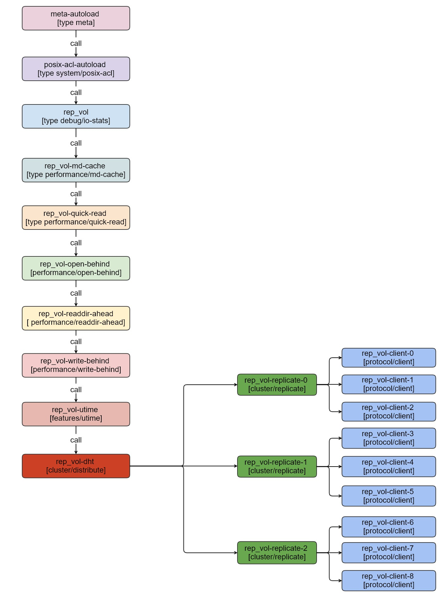

### cluster.read-hash-mode工作原理


####  read-hash-mode参数说明
```
[root@CentOS1 ~]$ gluster volume set help |grep cluster.read-hash-mode -A7
Option: cluster.read-hash-mode
Default Value: 1
Description: inode-read fops happen only on one of the bricks in replicate. AFR will prefer the one computed using the method specified using this option.
0 = first readable child of AFR, starting from 1st child.
1 = hash by GFID of file (all clients use same subvolume).
2 = hash by GFID of file and client PID.
3 = brick having the least outstanding read requests.
4 = brick having the least network ping latency.
```


#### read-hash-mode 定义的类型

```
//在afr.h中定义了read-hash-mode的几个变量值
typedef enum {
		//对用0值
    AFR_READ_POLICY_FIRST_UP,
    //对应1
    AFR_READ_POLICY_GFID_HASH,
    //对应2
    AFR_READ_POLICY_GFID_PID_HASH,
    //对应3
    AFR_READ_POLICY_LESS_LOAD,
    //对应4
    AFR_READ_POLICY_LEAST_LATENCY,
    //对应5
    AFR_READ_POLICY_LOAD_LATENCY_HYBRID,
} afr_read_hash_mode_t;
```


#### read-hash-mode 核心的实现函数
```
//priv->hash_mode为1或者2的情况下，是根据gfid或者pid进行SuperFastHash计算哈希值然后在针对priv->child_count取余，这可能会导致根据gfid或者pid导致IO读写不均衡
int afr_hash_child(afr_read_subvol_args_t *args, afr_private_t *priv,
               unsigned char *readable)
{
    uuid_t gfid_copy = {
        0,
    };
    pid_t pid;
    int child = -1;

    switch (priv->hash_mode) {
        case AFR_READ_POLICY_FIRST_UP:
            break;
        //根据gfid计算哈希取余，选取volume rep_vol-replicate-XXX其中一个rep_vol-client-XXX进行读写操作
        case AFR_READ_POLICY_GFID_HASH:
            gf_uuid_copy(gfid_copy, args->gfid);
            //当前测试环境是副本卷，3*3的副本卷分别有rep_vol-replicate-0，rep_vol-replicate-1，rep_vol-replicate-2，每个rep_vol-replicate-XXX包括了三个rep_vol-client-XXX,这里的afr_hash_child是在rep_vol-replicate-XXX中选择操作哪一个rep_vol-client-XXX，volume层级关系参见后续的replicat 卷的volume层级关系
            child = SuperFastHash((char *)gfid_copy, sizeof(gfid_copy))%priv->child_count;
            break;
        //根据glustefs fuse客户端的进程ID选择
        case AFR_READ_POLICY_GFID_PID_HASH:
            if (args->ia_type != IA_IFDIR) {
                /*
                 * Why getpid?  Because it's one of the cheapest calls
                 * available - faster than gethostname etc. - and
                 * returns a constant-length value that's sure to be
                 * shorter than a UUID. It's still very unlikely to be
                 * the same across clients, so it still provides good
                 * mixing.  We're not trying for perfection here. All we
                 * need is a low probability that multiple clients
                 * won't converge on the same subvolume.
                 */
                pid = getpid();
                memcpy(gfid_copy, &pid, sizeof(pid));
            }
            child = SuperFastHash((char *)gfid_copy, sizeof(gfid_copy))%priv->child_count;
            break;
        case AFR_READ_POLICY_LESS_LOAD:
            child = afr_least_pending_reads_child(priv, readable);
            break;
        case AFR_READ_POLICY_LEAST_LATENCY:
            child = afr_least_latency_child(priv, readable);
            break;
        case AFR_READ_POLICY_LOAD_LATENCY_HYBRID:
            child = afr_least_latency_times_pending_reads_child(priv, readable);
            break;
    }

    return child;
}

```

#### 调用链函数说明

#####  调用函数关系链
```
//按照从下往上的顺序调用，下面每一个xxx_lookup函数对应volume关系的xlator实例中的lookup函数，这里不多赘述
(gdb) bt
br client4_0_lookup 
br client_lookup 
br afr_discover_do
br afr_discover 
br afr_lookup (
br dht_do_revalidate
br dht_lookup 
br gf_utime_lookup
br wb_lookup 
br default_lookup 
br default_lookup 
br qr_lookup 
br mdc_lookup 
br io_stats_lookup 
br ga_lookup 
br default_lookup 
br meta_lookup 
br fuse_getattr 
br fuse_dispatch 
br gf_async
br fuse_thread_proc
```


##### 函数功能说明


- dht_lookup:该函数根据方位目录名称计算哈希值然后选择哪一个subvolume类型的rep_vol-replicate-xxx。比如这里选择了rep_vol-replicate-0,依次处理rep_vol-replicate-0的subvolume
```

int dht_lookup(call_frame_t *frame, xlator_t *this, loc_t *loc, dict_t *xattr_req)
{
	//根据访问的名称计算哈希,选择文件的layout
	dht_subvol_get_hashed(this, loc);
	dht_do_revalidate(call_frame_t *frame, xlator_t *this, loc_t *loc)
	{
	
		//获取到rep_vol-replicate-xxx的subvolume,针对subvolume的xlator调用conf->subvolumes[i]->fops->lookup,这里对应afr_lookup
        for (i = 0; i < call_cnt; i++) {
            STACK_WIND_COOKIE(frame, dht_revalidate_cbk, conf->subvolumes[i],
                              conf->subvolumes[i],
                              conf->subvolumes[i]->fops->lookup, loc,
                              local->xattr_req);
        }
	}
	//注册dht_lookup回调函数
	STACK_WIND_COOKIE(frame, dht_lookup_cbk, hashed_subvol, hashed_subvol, hashed_subvol->fops->lookup, loc, local->xattr_req);
}
```
- afr_lookup:该函数根据方位目录名称计算哈希值然后选择哪一个subvolume类型的rep_vol-replicate-xxx。比如这里选择了rep_vol-replicate-0,依次处理rep_vol-replicate-0的subvolume

```
int afr_lookup(call_frame_t *frame, xlator_t *this, loc_t *loc, dict_t *xattr_req) {
	afr_read_subvol_get(loc->parent, this, NULL, NULL, &event,AFR_DATA_TRANSACTION, NULL)
    {
       afr_read_subvol_select_by_policy(inode, this, intersection,args)
       {
       		afr_hash_child(&local_args, priv, readable)
       }
    }
    afr_lookup_do(frame, this, 0)
    {
    	/*
    	  获取afr_lookup_do函数参数xlator信息和当前xlator的children的xlator信息
    	 (gdb) p priv->children[0]->name
		 $56 = 0x2ab7b80099b0 "rep_vol-client-0"
		 (gdb) p priv->children[1]->name
 		 $57 = 0x2ab7b800b560 "rep_vol-client-1"
		 (gdb) p priv->children[2]->name
		 $58 = 0x2ab7b800e150 "rep_vol-client-2"
		 (gdb) p this->name
		 $59 = 0x2ab7b80214e0 "rep_vol-replicate-0"
		//这里的 priv->children[i]->fops->lookup 对应的是rep_vol-client-xxx的xlator的client_lookup
		 (gdb) p priv->children[i]->fops->lookup
		 $60 = (fop_lookup_t) 0x2ab7b6c081e7 <client_lookup>
		*/
    	for (i = 0; i < priv->child_count; i++) {
        if (local->child_up[i]) {
        	//执行下一个xlator的逻辑，这里和客户端日志中的final graph中的volume对应起来，通知注册afr_lookup回调函数，注册到frame->parent->ret
            STACK_WIND_COOKIE( frame, afr_lookup_cbk, (void *)(long)i, priv->children[i], priv->children[i]->fops->lookup, &local->loc, local->xattr_req);
    	}
    }
}
```
- client_lookup:该函数属于protocol/client的xlator,也是最终把请求提交到服务端的函数，这个函数里面有一个回调函数，这个回调函数是client4_0_lookup，最终的lookup的链路上回调函数按照frame->parent->ret一层一层的回调回去，这个lookup操作就完成了
```
static int32_t client_lookup(call_frame_t *frame, xlator_t *this, loc_t *loc, dict_t *xdata)
{
	 /*
	 (gdb) p proc
	 $61 = (rpc_clnt_procedure_t *) 0x2ab7b6e97eb0 <clnt4_0_fop_actors+432>
	 (gdb) p proc->fn
	 $62 = (clnt_fn_t) 0x2ab7b6c6f740 <client4_0_lookup>
	*/
	  proc = &conf->fops->proctable[GF_FOP_LOOKUP];
      if (proc->fn) {
        ret = proc->fn(frame, this, &args);
       }
       STACK_UNWIND_STRICT(lookup, frame, -1, ENOTCONN, NULL, NULL, NULL, NULL);
}
int32_t client4_0_lookup(call_frame_t *frame, xlator_t *this, void *data)
{
	//在client4_0_lookup_cbk中在每一层中调用frame->parent->ret的注册的链路上的lookup的回调函数
 	ret = client_submit_request(this, &req, frame, conf->fops, GFS3_OP_LOOKUP,  client4_0_lookup_cbk, &cp,(xdrproc_t)xdr_gfx_lookup_req);
 	
}


```
- 执行这个lookup核心链路: dht_look  --> afr_lookup --> client4_0_lookup;回调执行链路:client4_0_lookup_cbk -->  afr_lookup_cbk  -->  dht_lookup_cbk

####  replicat 卷的volume层级关系
- volume对应的xlator调用关系
  

- glusterfs-fuse日志中的呈现
```
//这些信息是从客户端日志的Final graph信息，这里进行的简化;执行顺序从下往上，每个volume之间会形成一定的父子关系，这volume关系也体现了调动的关系
volume rep_vol-client-0
    type protocol/client
    option remote-host 172.25.78.11
    option remote-subvolume /glusterfs/rep_vol/data0/brick
end-volume

volume rep_vol-client-1
    type protocol/client
    option remote-host 172.25.78.12
    option remote-subvolume /glusterfs/rep_vol/data0/brick
end-volume

volume rep_vol-client-2
    type protocol/client
    option remote-host 172.25.78.13
    option remote-subvolume /glusterfs/rep_vol/data0/brick
end-volume

volume rep_vol-replicate-0
    type cluster/replicate
    option afr-pending-xattr rep_vol-client-0,rep_vol-client-1,rep_vol-client-2
    option use-compound-fops off
    subvolumes rep_vol-client-0 rep_vol-client-1 rep_vol-client-2
end-volume

volume rep_vol-client-3
    type protocol/client
    option remote-host 172.25.78.11
    option remote-subvolume /glusterfs/rep_vol/data1/brick
end-volume

volume rep_vol-client-4
    type protocol/client
    option remote-host 172.25.78.12
    option remote-subvolume /glusterfs/rep_vol/data1/brick
end-volume

volume rep_vol-client-5
    type protocol/client
    option remote-host 172.25.78.13
    option remote-subvolume /glusterfs/rep_vol/data1/brick
end-volume

volume rep_vol-replicate-1
    type cluster/replicate
    option afr-pending-xattr rep_vol-client-3,rep_vol-client-4,rep_vol-client-5
    option use-compound-fops off
    subvolumes rep_vol-client-3 rep_vol-client-4 rep_vol-client-5
end-volume

volume rep_vol-client-6
    type protocol/client
    option remote-host 172.25.78.11
    option remote-subvolume /glusterfs/rep_vol/data2/brick
end-volume

volume rep_vol-client-7
    type protocol/client
    option remote-host 172.25.78.12
    option remote-subvolume /glusterfs/rep_vol/data2/brick
end-volume

volume rep_vol-client-8
    type protocol/client
    option remote-host 172.25.78.13
    option remote-subvolume /glusterfs/rep_vol/data2/brick
end-volume

volume rep_vol-replicate-2
    type cluster/replicate
    option afr-pending-xattr rep_vol-client-6,rep_vol-client-7,rep_vol-client-8
    option use-compound-fops off
    subvolumes rep_vol-client-6 rep_vol-client-7 rep_vol-client-8
end-volume

volume rep_vol-dht
    type cluster/distribute
    option lock-migration off
    option force-migration off
    subvolumes rep_vol-replicate-0 rep_vol-replicate-1 rep_vol-replicate-2
end-volume

volume rep_vol-utime
    type features/utime
    option noatime on
    subvolumes rep_vol-dht
end-volume

volume rep_vol-write-behind
    type performance/write-behind
    subvolumes rep_vol-utime
end-volume

volume rep_vol-readdir-ahead
    type performance/readdir-ahead
    option parallel-readdir off
    option rda-request-size 131072
    option rda-cache-limit 10MB
    subvolumes rep_vol-write-behind
end-volume

volume rep_vol-open-behind
    type performance/open-behind
    subvolumes rep_vol-readdir-ahead
end-volume

volume rep_vol-quick-read
    type performance/quick-read
    subvolumes rep_vol-open-behind
end-volume

volume rep_vol-md-cache
    type performance/md-cache
    option cache-posix-acl true
    subvolumes rep_vol-quick-read
end-volume

volume rep_vol
    type debug/io-stats
    option log-level TRACE
    option threads 16
    option latency-measurement off
    option count-fop-hits off
    option global-threading off
    subvolumes rep_vol-md-cache
end-volume

volume posix-acl-autoload
    type system/posix-acl
    subvolumes rep_vol
end-volume

volume meta-autoload
    type meta
    subvolumes posix-acl-autoload
end-volume
```
