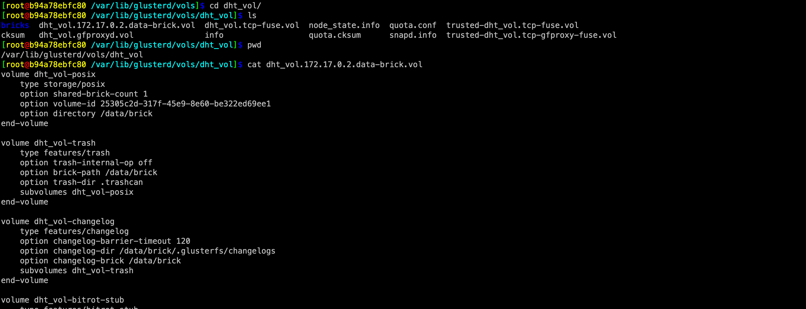
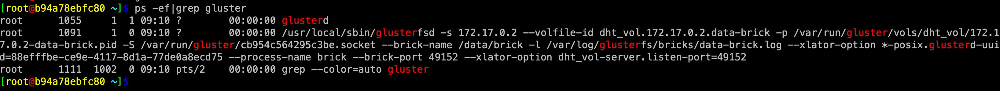

### glusterfsd启动都经历了什么
| author | update |
| ------ | ------ |
| perrynzhou@gmail.com | 2020/09/24 |

###### 0.存在的疑惑
- glusterd启动后怎么把glusterfsd的brick进程拉起来？
- glusterfsd启动的参数从哪里获取？
- glusterfsd如何加载的呢？
- glusterfsd和glusterd启动后各自都是什么角色？(后续再讨论)
######  1. glusterfs的入口函数解释
- glusterfsd中main方法加载xlator {name = 0x687dd0 "management", type = 0x687f50 "mgmt/glusterd"}，然后fork一个子进程加载mgmt/glusterd中的init方法
###### 2.glusterd启动过程
- 子进程中调用mgmt/glusterd对应源文件中glusterd.c中的init,针对glusterd进行初始化，依次会调用如下方法:
  - glusterfs_volumes_init   
  -  glusterd.c:init
  - glusterd_spawn_daemons
  - glusterd_restart_bricks
  - glusterd_brick_start
  - glusterd_volume_start_glusterfs
  - runner_run
  - runner_start:fork子进程，调用execvp加载/usr/local/sbin/glusterfsd二进制文件
  ```
  int runner_start(runner_t *runner)
  {
         //-----忽略----------------
	execvp(runner->argv[0], runner->argv);
         //-----忽略----------------
  }
  ```
###### 3.glusterfsd如何加载xlator
- glusterfsd是通过读取配置文件/var/lib/glusterd/vols/dht_vol/dht_vol.172.17.0.2.data-brick.vol来加载glusterfsd运行期间需要的xlator，这些配置信息是用户创建volume时候系统生成的



###### 4. glusterd启动后进程列表
- runner_start后继续glusterfsd.c中的main方法，启动对应的服务，glusterfsd正式启动了，就如systemctl start glusterd后出现如下的结果:


###### 5.glusterfsd启动流程
- 上个步骤通过runner_start加载glusterfsd的二进制进程，glusterfsd进入初始化节点，首先 glusterfs_listener_init 初始化tcp连接
- glusterfsd通过tcp连接到glusterd获取volume xlator信息，准备构建xlator的graph.

```

volume xlator信息如下:

(gdb) p rsp.spec       
$6 = 0x7fffe4002fc0 "volume dht_vol-posix\n    type storage/posix\n    option shared-brick-count 1\n    option volume-id 25305c2d-317f-45e9-8e60-be322ed69ee1\n    option directory /data/brick\nend-volume\n\nvolume dht_vol-trash\n    type features/trash\n    option trash-internal-op off\n    option brick-path /data/brick\n    option trash-dir .trashcan\n    subvolumes dht_vol-posix\nend-volume\n\nvolume dht_vol-changelog\n    type features/changelog\n    option changelog-barrier-timeout 120\n    option changelog-dir /data/brick/.glusterfs/changelogs\n    option changelog-brick /data/brick\n    subvolumes dht_vol-trash\nend-volume\n\nvolume dht_vol-bitrot-stub\n    type features/bitrot-stub\n    option bitrot disable\n    option export /data/brick\n    subvolumes dht_vol-changelog\nend-volume\n\nvolume dht_vol-access-control\n    type features/access-control\n    subvolumes dht_vol-bitrot-stub\nend-volume\n\nvolume dht_vol-locks\n    type features/locks\n    option enforce-mandatory-lock off\n    subvolumes dht_vol-access-control\nend-volume\n\nvolume dht_vol-worm\n    type features/worm\n    option worm-files-deletable on\n    option worm-file-level off\n    option worm off\n    subvolumes dht_vol-locks\nend-volume\n\nvolume dht_vol-read-only\n    type features/read-only\n    option read-only off\n    subvolumes dht_vol-worm\nend-volume\n\nvolume dht_vol-leases\n    type features/leases\n    option leases off\n    subvolumes dht_vol-read-only\nend-volume\n\nvolume dht_vol-upcall\n    type features/upcall\n    option cache-invalidation off\n    subvolumes dht_vol-leases\nend-volume\n\nvolume dht_vol-io-threads\n    type performance/io-threads\n    subvolumes dht_vol-upcall\nend-volume\n\nvolume dht_vol-selinux\n    type features/selinux\n    option selinux on\n    subvolumes dht_vol-io-threads\nend-volume\n\nvolume dht_vol-marker\n    type features/marker\n    option inode-quota off\n    option quota off\n    option gsync-force-xtime off\n    option xtime off\n    option quota-version 0\n    option timestamp-file /var/lib/glusterd/vols/dht_vol/marker.tstamp\n    option volume-uuid 25305c2d-317f-45e9-8e60-be322ed69ee1\n    subvolumes dht_vol-selinux\nend-volume\n\nvolume dht_vol-barrier\n    type features/barrier\n    option barrier-timeout 120\n    option barrier disable\n    subvolumes dht_vol-marker\nend-volume\n\nvolume dht_vol-index\n    type features/index\n    option xattrop-pending-watchlist trusted.afr.dht_vol-\n    option xattrop-dirty-watchlist trusted.afr.dirty\n    option index-base /data/brick/.glusterfs/indices\n    subvolumes dht_vol-barrier\nend-volume\n\nvolume dht_vol-quota\n    type features/quota\n    option deem-statfs off\n    option server-quota off\n    option volume-uuid dht_vol\n    subvolumes dht_vol-index\nend-volume\n\nvolume dht_vol-io-stats\n    type debug/io-stats\n    option count-fop-hits off\n    option latency-measurement off\n    option log-level INFO\n    option unique-id /data/brick\n    subvolumes dht_vol-quota\nend-volume\n\nvolume /data/brick\n    type performance/decompounder\n    subvolumes dht_vol-io-stats\nend-volume\n\nvolume dht_vol-server\n    type protocol/server\n    option transport.listen-backlog 1024\n    option transport.socket.keepalive-count 9\n    option transport.socket.keepalive-interval 2\n    option transport.socket.keepalive-time 20\n    option transport.socket.ssl-enabled off\n    option transport.socket.keepalive 1\n    option auth.addr./data/brick.allow *\n    option auth-path /data/brick\n    option auth.login.b26ac1fd-40a4-4c6e-b211-a9f2b58beedc.password 4eda9afe-9466-4283-b175-6020d5981994\n    option auth.login./data/brick.allow b26ac1fd-40a4-4c6e-b211-a9f2b58beedc\n    option transport.address-family inet\n    option transport-type tcp\n    subvolumes /data/brick\nend-volume\n"
```
- 根据xlator获取初构建graph信息，初始化每个xlator的init方法，这个时候glusterfsd初始化成功
###### 6. gdb 调试方法
- gdb break 信息
```
set print pretty on
//调试子进程,子进程会加载执行mgmt/glusterd/src/glusterd.c:init
set follow-fork-mode child  
set detach-on-fork off
br glusterfsd.c:main
br  br glusterfs_volumes_init   //glusterd和glusterfsd都会调用该方法
br glusterd.c:init
//------ 进入init函数后执行如下------
/* 进入这个函数后设置调试父进程   
  set follow-fork-mode parent
  set detach-on-fork on
 */
br glusterd_spawn_daemons
br glusterd_restart_bricks
br glusterd_brick_start
br glusterd_volume_start_glusterfs
/* 进入这个函数后设置调试父进程   
  set follow-fork-mode child
  set detach-on-fork on
 */
br runner_run
br runner_log

br runner_start 

/** 进入runner_start 后设置如下断点，glusterfsd启动以后会按照如下的调用链进行 */
br glusterfs_volumes_init   
br glusterfs_listener_init  //glusterd不会调用该方法
br glusterfs_mgmt_init      //glusterd不会调用该方法
br mgmt_rpc_notify
br glusterfs_volfile_fetch
br glusterfs_volfile_fetch_one
br mgmt_getspec_cbk 
br glusterfs_process_volfp
br glusterfs_graph_activate
br glusterfs_graph_init
```
- 1.glusterd gdb日志
```
[root@b94a78ebfc80 ~]$ gdb glusterd
GNU gdb (GDB) Red Hat Enterprise Linux 7.6.1-115.el7
Copyright (C) 2013 Free Software Foundation, Inc.
License GPLv3+: GNU GPL version 3 or later <http://gnu.org/licenses/gpl.html>
This is free software: you are free to change and redistribute it.
There is NO WARRANTY, to the extent permitted by law.  Type "show copying"
and "show warranty" for details.
This GDB was configured as "x86_64-redhat-linux-gnu".
For bug reporting instructions, please see:
<http://www.gnu.org/software/gdb/bugs/>...
Reading symbols from /usr/local/sbin/glusterfsd...done.
(gdb) br glusterfsd.c:main
Breakpoint 1 at 0x40b71d: file glusterfsd.c, line 2746.
(gdb) br glusterd.c:init
No source file named glusterd.c.
Make breakpoint pending on future shared library load? (y or [n]) y
Breakpoint 2 (glusterd.c:init) pending.
(gdb) set print pretty on
(gdb) set follow-fork-mode child  
(gdb) set detach-on-fork off
(gdb) c
The program is not being run.
(gdb) r
Starting program: /usr/local/sbin/glusterd 
[Thread debugging using libthread_db enabled]
Using host libthread_db library "/lib64/libthread_db.so.1".

Breakpoint 1, main (argc=1, argv=0x7fffffffe778) at glusterfsd.c:2746
2746        glusterfs_ctx_t *ctx = NULL;
Missing separate debuginfos, use: debuginfo-install glibc-2.17-292.el7.x86_64 libuuid-2.23.2-61.el7_7.1.x86_64 openssl-libs-1.0.2k-19.el7.x86_64 zlib-1.2.7-18.el7.x86_64
(gdb) c
Continuing.
[New process 956]
[Thread debugging using libthread_db enabled]
Using host libthread_db library "/lib64/libthread_db.so.1".
[New Thread 0x7ffff5431700 (LWP 957)]
[New Thread 0x7ffff4c30700 (LWP 958)]
[New Thread 0x7ffff442f700 (LWP 959)]
[New Thread 0x7ffff3c2e700 (LWP 960)]
[New Thread 0x7ffff342d700 (LWP 961)]
[New Thread 0x7ffff2c2c700 (LWP 962)]
Reading symbols from /usr/local/lib/glusterfs//xlator/mgmt/glusterd.so...done.
[Switching to Thread 0x7ffff7fea4c0 (LWP 956)]

Breakpoint 2, init (this=0x686d40) at glusterd.c:1373
1373        int32_t ret = -1;
Missing separate debuginfos, use: debuginfo-install glibc-2.17-292.el7.x86_64 libuuid-2.23.2-61.el7_7.1.x86_64 libxml2-2.9.1-6.el7_2.3.x86_64 openssl-libs-1.0.2k-19.el7.x86_64 userspace-rcu-0.7.16-1.el7.x86_64 xz-libs-5.2.2-1.el7.x86_64 zlib-1.2.7-18.el7.x86_64
(gdb)  set follow-fork-mode parent
(gdb)   set detach-on-fork on
(gdb) br glusterd_spawn_daemons
Breakpoint 3 at 0x7ffff1f79f85: file glusterd-utils.c, line 3619.
(gdb) br glusterd_restart_bricks
Breakpoint 4 at 0x7ffff1f832e3: file glusterd-utils.c, line 6334.
(gdb) br glusterd_brick_start
Breakpoint 5 at 0x7ffff1f826cd: file glusterd-utils.c, line 6107.
(gdb) br glusterd_volume_start_glusterfs
Breakpoint 6 at 0x7ffff1f73f5f: file glusterd-utils.c, line 2024.
(gdb) c
Continuing.
Reading symbols from /usr/local/lib/glusterfs//rpc-transport/socket.so...done.
Reading symbols from /usr/local/lib/glusterfs//rpc-transport/rdma.so...done.
Detaching after fork from child process 964.
Detaching after fork from child process 965.
Detaching after fork from child process 966.
Detaching after fork from child process 967.
Detaching after fork from child process 968.
Detaching after fork from child process 969.
Detaching after fork from child process 970.
Detaching after fork from child process 971.
Detaching after fork from child process 972.
Detaching after fork from child process 973.
Detaching after fork from child process 974.
Detaching after fork from child process 975.
Detaching after fork from child process 976.
Detaching after fork from child process 977.
Detaching after fork from child process 978.
Detaching after fork from child process 979.
Detaching after fork from child process 980.
Detaching after fork from child process 981.
Detaching after fork from child process 982.
Detaching after fork from child process 983.
Detaching after fork from child process 984.
Detaching after fork from child process 985.
Detaching after fork from child process 986.
Detaching after fork from child process 987.
Detaching after fork from child process 988.
[Switching to Thread 0x7ffff342d700 (LWP 961)]

Breakpoint 3, glusterd_spawn_daemons (opaque=0x0) at glusterd-utils.c:3619
3619        glusterd_conf_t *conf = THIS->private;
Missing separate debuginfos, use: debuginfo-install keyutils-libs-1.5.8-3.el7.x86_64 krb5-libs-1.15.1-37.el7_7.2.x86_64 libcom_err-1.42.9-16.el7.x86_64 libibverbs-22.1-3.el7.x86_64 libnl3-3.2.28-4.el7.x86_64 librdmacm-22.1-3.el7.x86_64 libselinux-2.5-14.1.el7.x86_64 pcre-8.32-17.el7.x86_64
(gdb) n
3620        int ret = -1;
(gdb) 
3622        synclock_lock(&conf->big_lock);
(gdb) 
[New Thread 0x7fffef606700 (LWP 989)]
3623        glusterd_restart_bricks();
(gdb) 

Breakpoint 4, glusterd_restart_bricks (opaque=0x7fffef9a9fc8) at glusterd-utils.c:6334
6334        int ret = 0;
(gdb) 
6335        glusterd_volinfo_t *volinfo = NULL;
(gdb) 
6336        glusterd_brickinfo_t *brickinfo = NULL;
(gdb)   set follow-fork-mode child
(gdb)   set detach-on-fork on
(gdb) br runner_run
Breakpoint 7 at 0x7ffff7b35f04: runner_run. (2 locations)
(gdb) br runner_start
Breakpoint 8 at 0x7ffff7b35825: runner_start. (2 locations)
(gdb) info break
Num     Type           Disp Enb Address            What
1       breakpoint     keep y   <MULTIPLE>         
        breakpoint already hit 1 time
1.1                         y     0x000000000040b71d in main at glusterfsd.c:2746 inf 1
1.2                         y     0x000000000040b71d in main at glusterfsd.c:2746 inf 2
2       breakpoint     keep y   0x00007ffff1f3a7ee in init at glusterd.c:1373 inf 2
        breakpoint already hit 1 time
3       breakpoint     keep y   0x00007ffff1f79f85 in glusterd_spawn_daemons at glusterd-utils.c:3619 inf 2
        breakpoint already hit 1 time
4       breakpoint     keep y   0x00007ffff1f832e3 in glusterd_restart_bricks at glusterd-utils.c:6334 inf 2
        breakpoint already hit 1 time
5       breakpoint     keep y   0x00007ffff1f826cd in glusterd_brick_start at glusterd-utils.c:6107 inf 2
6       breakpoint     keep y   0x00007ffff1f73f5f in glusterd_volume_start_glusterfs at glusterd-utils.c:2024 inf 2
7       breakpoint     keep y   <MULTIPLE>         
7.1                         y     0x00007ffff7b35f04 in runner_run at run.c:430 inf 1
7.2                         y     0x00007ffff7b35f04 in runner_run at run.c:430 inf 2
8       breakpoint     keep y   <MULTIPLE>         
8.1                         y     0x00007ffff7b35825 in runner_start at run.c:259 inf 1
8.2                         y     0x00007ffff7b35825 in runner_start at run.c:259 inf 2
(gdb) c
Continuing.

Breakpoint 5, glusterd_brick_start (volinfo=0x6db4b0, brickinfo=0x6ef490, wait=false, only_connect=false) at glusterd-utils.c:6107
6107        int ret = -1;
(gdb) c
Continuing.
[New Thread 0x7fffeee05700 (LWP 991)]

Breakpoint 6, glusterd_volume_start_glusterfs (volinfo=0x6db4b0, brickinfo=0x6ef490, wait=false) at glusterd-utils.c:2024
2024        int32_t ret = -1;
(gdb) c
Continuing.
[New process 992]
[Thread debugging using libthread_db enabled]
Using host libthread_db library "/lib64/libthread_db.so.1".
[Switching to Thread 0x7ffff342d700 (LWP 992)]

Breakpoint 8, runner_start (runner=0x7fffef800e00) at run.c:259
259         int pi[3][2] = {{-1, -1}, {-1, -1}, {-1, -1}};
(gdb) n
261         int ret = 0;
(gdb) 
262         int errno_priv = 0;
(gdb) 
263         int i = 0;
(gdb) 
266         if (runner->runerr || !runner->argv) {
(gdb) 
271         GF_ASSERT(runner->argv[0]);
(gdb)  set follow-fork-mode child
(gdb)   set detach-on-fork on
(gdb) n
276         ret = pipe(xpi);
(gdb) 
277         if (ret != -1)
(gdb) 
278             ret = fcntl(xpi[1], F_SETFD, FD_CLOEXEC);
(gdb) 
280         for (i = 0; i < 3; i++) {
(gdb) 
281             if (runner->chfd[i] != -2)
(gdb) 
282                 continue;
(gdb) 
280         for (i = 0; i < 3; i++) {
(gdb) 
281             if (runner->chfd[i] != -2)
(gdb) 
282                 continue;
(gdb) 
280         for (i = 0; i < 3; i++) {
(gdb) 
281             if (runner->chfd[i] != -2)
(gdb) 
282                 continue;
(gdb) 
280         for (i = 0; i < 3; i++) {
(gdb) 
291         if (ret != -1)
(gdb) 
292             runner->chpid = fork();
(gdb) 
[New process 995]
[Thread debugging using libthread_db enabled]
Using host libthread_db library "/lib64/libthread_db.so.1".
[Switching to Thread 0x7ffff342d700 (LWP 995)]
293         switch (runner->chpid) {
327                 if (ret != -1) {
(gdb) 
328                     int fdv[4] = {0, 1, 2, xpi[1]};
(gdb) 
330                     ret = close_fds_except(fdv, sizeof(fdv) / sizeof(*fdv));
(gdb) 
333                 if (ret != -1) {
(gdb) 
335                     sigemptyset(&set);
(gdb) 
336                     sigprocmask(SIG_SETMASK, &set, NULL);
(gdb) 
338                     execvp(runner->argv[0], runner->argv);
(gdb) p runner->argv[0]
$1 = 0x7fffe8000c60 "/usr/local/sbin/glusterfsd"
(gdb) p runner->argv
$2 = (char **) 0x7fffe8000970
(gdb) p/s  runner->argv
$3 = (char **) 0x7fffe8000970
(gdb) p/s  runner->argv[1]
$4 = 0x7fffe8000ce0 "-s"
(gdb) p/s  runner->argv[2]
$5 = 0x7fffe8000d50 "172.17.0.2"
(gdb) p/s  runner->argv[3]
$6 = 0x7fffe8000dc0 "--volfile-id"
(gdb) p/s  runner->argv[4]
$7 = 0x7fffe8000e30 "dht_vol.172.17.0.2.data-brick"
(gdb) p/s  runner->argv[5]
$8 = 0x7fffe8000eb0 "-p"
(gdb) p/s  runner->argv[6]
$9 = 0x7fffe8000f20 "/var/run/gluster/vols/dht_vol/172.17.0.2-data-brick.pid"
(gdb) p/s  runner->argv[7]
$10 = 0x7fffe8000fc0 "-S"
(gdb) p/s  runner->argv[8]
$11 = 0x7fffe8001030 "/var/run/gluster/cb954c564295c3be.socket"
(gdb) p/s  runner->argv[9]
$12 = 0x7fffe80010c0 "--brick-name"
(gdb) p/s  runner->argv[10]
$13 = 0x7fffe8001130 "/data/brick"
(gdb) p/s  runner->argv[11]
$14 = 0x7fffe80011a0 "-l"
(gdb) p/s  runner->argv[12]
$15 = 0x7fffe8001210 "/var/log/glusterfs/bricks/data-brick.log"
(gdb) p/s  runner->argv[13]
$16 = 0x7fffe80012a0 "--xlator-option"
(gdb) p/s  runner->argv[14]
$17 = 0x7fffe8001310 "*-posix.glusterd-uuid=88efffbe-ce9e-4117-8d1a-77de0a8ecd75"
(gdb) p/s  runner->argv[15]
$18 = 0x7fffe80013b0 "--process-name"
(gdb) p/s  runner->argv[16]
$19 = 0x7fffe8001420 "brick"
(gdb) p/s  runner->argv[17]
$20 = 0x7fffe8001490 "--brick-port"
(gdb) p/s  runner->argv[18]
$21 = 0x7fffe8001500 "49152"
(gdb) p/s  runner->argv[19]
$22 = 0x7fffe8001570 "--xlator-option"
(gdb) p/s  runner->argv[20]
$23 = 0x7fffe80015e0 "dht_vol-server.listen-port=49152"
(gdb) p/s  runner->argv[21]
$24 = 0x0
(gdb) 

```
- glusterfsd gdb 日志
```
(gdb) info break
Num     Type           Disp Enb Address            What
1       breakpoint     keep y   <MULTIPLE>         
        breakpoint already hit 2 times
1.1                         y     0x000000000040b71d in main at glusterfsd.c:2746 inf 1
1.2                         y     0x000000000040b71d in main at glusterfsd.c:2746 inf 5, 4, 3
2       breakpoint     keep y   <PENDING>          glusterd.c:init inf 5, 4, 3
        breakpoint already hit 1 time
3       breakpoint     keep y   <PENDING>          glusterd_spawn_daemons inf 5, 4, 3
        breakpoint already hit 1 time
4       breakpoint     keep y   <PENDING>          glusterd_restart_bricks inf 5, 4, 3
        breakpoint already hit 1 time
5       breakpoint     keep y   <PENDING>          glusterd_brick_start inf 5, 4, 3
        breakpoint already hit 1 time
6       breakpoint     keep y   <PENDING>          glusterd_volume_start_glusterfs inf 5, 4, 3
        breakpoint already hit 1 time
7       breakpoint     keep y   <MULTIPLE>         
7.1                         y     0x00007ffff7b35f04 in runner_run at run.c:430 inf 1
7.2                         y     0x00007ffff7b35f04 in runner_run at run.c:430 inf 5, 4, 3
8       breakpoint     keep y   <MULTIPLE>         
        breakpoint already hit 1 time
8.1                         y     0x00007ffff7b35825 in runner_start at run.c:259 inf 1
8.2                         y     0x00007ffff7b35825 in runner_start at run.c:259 inf 5, 4, 3
9       breakpoint     keep y   <PENDING>          server-rpc-fops_v2.c:server4_0_mkdir
10      breakpoint     keep y   <PENDING>          server-resolve.c:server_resolve
11      breakpoint     keep y   <MULTIPLE>         
        breakpoint already hit 1 time
11.1                        y     0x000000000040b603 in glusterfs_volumes_init at glusterfsd.c:2704 inf 1
11.2                        y     0x000000000040b603 in glusterfs_volumes_init at glusterfsd.c:2704 inf 5, 4, 3
12      breakpoint     keep y   <MULTIPLE>         
12.1                        y     0x000000000040b390 in glusterfs_process_volfp at glusterfsd.c:2626 inf 1
12.2                        y     0x000000000040b390 in glusterfs_process_volfp at glusterfsd.c:2626 inf 5, 4, 3
13      breakpoint     keep y   <MULTIPLE>         
13.1                        y     0x000000000040710f in get_volfp at glusterfsd.c:781 inf 1
13.2                        y     0x000000000040710f in get_volfp at glusterfsd.c:781 inf 5, 4, 3
14      breakpoint     keep y   <MULTIPLE>         
        breakpoint already hit 1 time
14.1                        y     0x0000000000412581 in glusterfs_mgmt_init at glusterfsd-mgmt.c:2648 inf 1
14.2                        y     0x0000000000412581 in glusterfs_mgmt_init at glusterfsd-mgmt.c:2648 inf 5, 4, 3
15      breakpoint     keep y   <MULTIPLE>         
        breakpoint already hit 1 time
---Type <return> to continue, or q <return> to quit---
15.1                        y     0x0000000000411848 in glusterfs_volfile_fetch at glusterfsd-mgmt.c:2270 inf 1
15.2                        y     0x0000000000411848 in glusterfs_volfile_fetch at glusterfsd-mgmt.c:2270 inf 5, 4, 3
16      breakpoint     keep y   <MULTIPLE>         
        breakpoint already hit 1 time
16.1                        y     0x00000000004114ed in glusterfs_volfile_fetch_one at glusterfsd-mgmt.c:2166 inf 1
16.2                        y     0x00000000004114ed in glusterfs_volfile_fetch_one at glusterfsd-mgmt.c:2166 inf 5, 4, 3
17      breakpoint     keep y   <MULTIPLE>         
        breakpoint already hit 1 time
17.1                        y     0x0000000000410a85 in mgmt_getspec_cbk at glusterfsd-mgmt.c:1922 inf 1
17.2                        y     0x0000000000410a85 in mgmt_getspec_cbk at glusterfsd-mgmt.c:1922 inf 5, 4, 3
18      breakpoint     keep y   <MULTIPLE>         
18.1                        y     0x000000000040b390 in glusterfs_process_volfp at glusterfsd.c:2626 inf 1
18.2                        y     0x000000000040b390 in glusterfs_process_volfp at glusterfsd.c:2626 inf 5, 4, 3
(gdb) 
```
