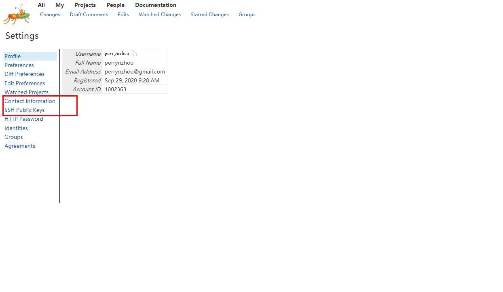

## glusterfs 代码提交流程

- git配置

  ```
  git config --global user.name "perrynzhou"
  git config --global user.email "perrynzhou@gmail.com"
  ssh-keygen -t rsa -C "perrynzhou@gmail.com"
  ```

- 登陆[Gerrit](http://review.gluster.org/)和在github上认证

  ```
  https://review.gluster.org/#/dashboard/self
  ```
- 在红色框内配置自己github邮箱和sshkey,配置完毕后需要登陆邮箱地址进行确认
  

- 克隆代码
```
git clone ssh://perrynzhou@review.gluster.org/glusterfs.git
```
- checkout分支
```
cd glusterfs
git checkout -b perryn/{问题}-dev
```
- 修改代码,并提交
```
 git add . --all
 git commit -m "fixed xxx issue"
 ./rfc.sh
 //接着输入这个问题关联的issue的id,比如https://github.com/gluster/glusterfs/issues/1499 这个issue的id就是1499
```
- 修改change-id和修改message、Signed-off-by

```
$ git commit --amend
//git commit -m "message",这的信息就是message
fixed AFR_READ_POLICY_GFID_PID_HASH policy bug

//change-id可以手动的修改为某一次的change-id
Change-Id: Ib927a770a486c95e4b157e76ba96e9904d1a9716
//这个关联的是哪一个issue
Fixes: #1499
//添加这一行，写上自己的Signed-off-by信息
Signed-off-by: perrynzhou <perrynzhou@gmail.com>                                                                                                       
# Please enter the commit message for your changes. Lines starting
# with '#' will be ignored, and an empty message aborts the commit.
#                        
# Date:      Tue Sep 29 17:22:42 2020 +0800
#                        
# HEAD detached from 2d2ea54a2
# Changes to be committed:
#       modified:   xlators/cluster/afr/src/afr-common.c
#      

$ ./rfc.sh
```