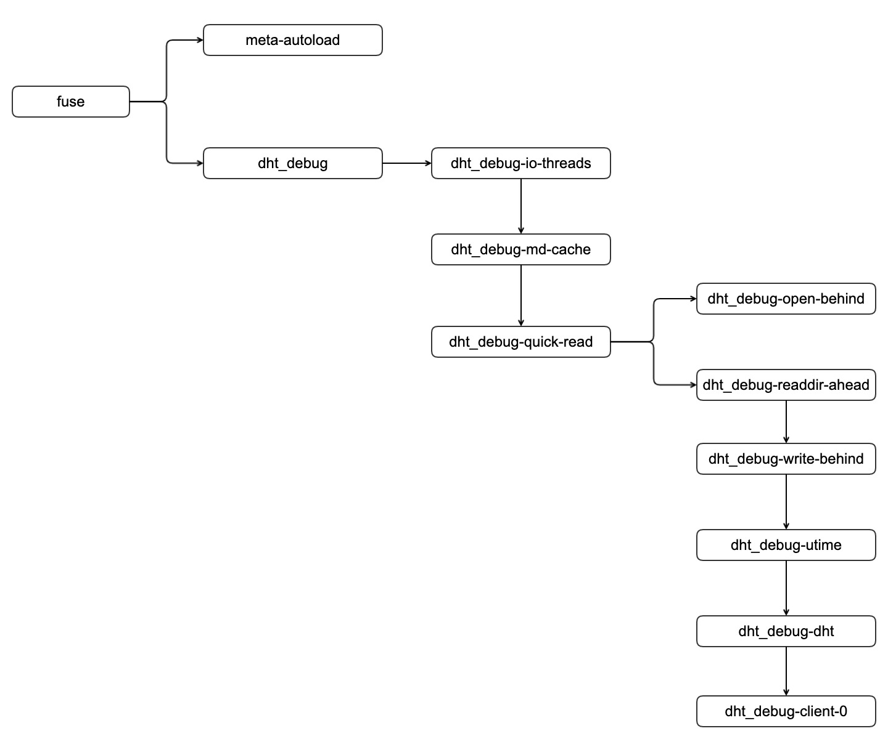
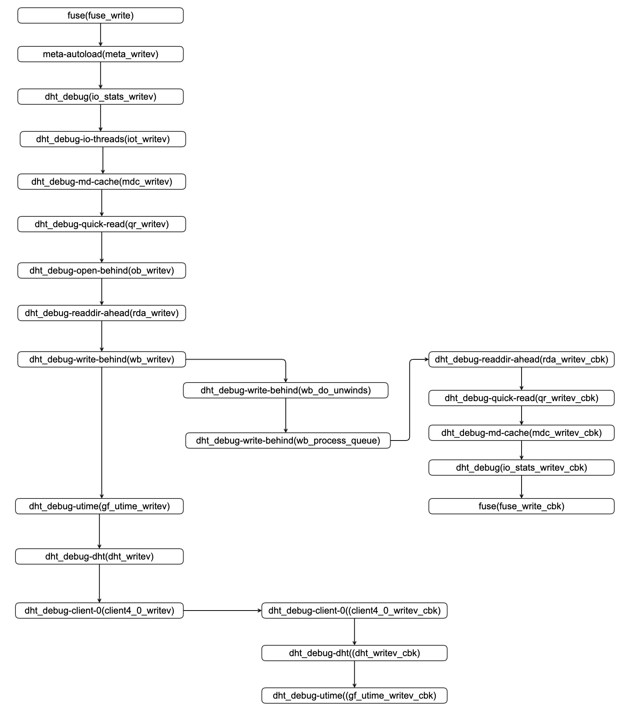

## glusterfs-write调用链分析

| 作者 | 时间 |QQ技术交流群 |
| ------ | ------ |------ |
| perrynzhou@gmail.com |2020/12/01 |中国开源存储技术交流群(672152841) |

###  glusterfs 中的STACK_WIND和STACK_UNWIND如何协调工作?
- 比如glusterfs客户端需要加载三个xlator，每一个xlator都有write和write回调方法方法，三个xaltor定义如下：

```c
xlator-a -->a_write a_write_cb
xlator-b -->b_write  b_write_cb
xlator-c -->c_write c_write_cb
```

 glusterfs 的架构基于xlator的堆栈,比如一个写请求需要经过a、b、c这三个xaltor的处理，从xlator a开始，执行到xlator c结束。那么这三个xlator是如何从上一个xlator传递给下一个xlator的呢？请求会通过如下6步

- 调用xlator a的a_write，在当前xlator-a的frame(a-frame)的ret字段设置a_write_cb，注册回调函数，通过STACK_WIND传递对应的下一个xlator-b
- 调用xlator-b的b_write,设置当前frame设置上一层(parent)的frame为a-frame,同时设置当前frame的回调函数为b_write_cb(当前frame的ret字段，这是注册回调函数),通过STACK_WIND传递对应的下一个xlator-c
- 调用xlator-c的c_write,在xlator-c的frame设置上一层(parent)的frame为b-frame,同时设置当前frame的回调函数为b_write_cb(当前frame的ret字段，这是注册回调函数),,通过STACK_WIND传递对应的下一个xlator-c
- 执行完毕xlator-c的c-write函数后，通过传递参数到STACK_UNWIND,执行c_write_cb函数
- 在c_write_cb函数中执行，找到当前frame的父frame,通过传递参数到STACK_UNWIND,在c_write_cb中执行frame->ret(b_write_cb函数)
- 在执行b_write_cb函数过程中，找到当前frame的父frame,通过传递参数到STACK_UNWIND,在b_write_cb中执行frame->ret(a_write_cb函数)

glusterfs 中操作通过STACK_WIND形式完成第一个xlator的op到最后一个xlator的(上一个xlator的frame是下一个xlator的父亲)，同时在这个xlator从上往下执行过程中，每一层xlator在请求的frame中注册当前的op的回调函数，同时设置当前frame上一个xlator处理的frame。执行到最后一个xlator后，按照栈的方式开始调用最后一个xlator的op回调函数，每个xlator回调函数中通过STACK_UNWIND_STRICT调用父xlator的op的回调函数.执行的路基的伪代码如下:


```
//xlator 中的op执行的顺序
main(xlator xa,frame fa)
{
	STACK_WIND{
		xa->a_write()
		fa->parent = NULL
		fa->ret = a_write_cb
	}
}
a_write(xlator xb,frame fb)
{
	STACK_WIND{
		xb->b_write()
		fb->parent = fa
		fb->ret = a_write_cb
	}
}
c_write(xlator xc,frame fc)
{
		xc->c_write()
		fc->parent = fb
		
		xc->c_write_cb()
		
}

//xlator中op回调函数执行路径
c_write_cb(){
	STACK_UNWIND{
		fb->b_write_cb()
	}
}
b_write_cb(){
	STACK_UNWIND{
		fa->a_write_cb()
	}
}

```


- frame定义

  ```
  // glusterfs中的请求都是以call_frame为参数进行
  struct _call_frame {
      call_stack_t *root;   /* stack root */
      //glusterfs一个操作由很多的xlator一起完成，每个xlator处理请求都会传递call_frame作为处理函数参数
      //parent保存上一个xlator处理请求的call_frame
      call_frame_t *parent; /* previous BP */
      struct list_head frames;
      void *local;    /* local variables */
      //this,保存当前xlator的指针
      xlator_t *this; /* implicit object */
      //每个xlator在当前frame中注册的操作的回调函数
      ret_fn_t ret;   /* op_return address */
      int32_t ref_count;
      gf_lock_t lock;
      void *cookie; /* unique cookie */
      gf_boolean_t complete;
  
      glusterfs_fop_t op;
      struct timespec begin; /* when this frame was created */
      struct timespec end;   /* when this frame completed */
      const char *wind_from;
      const char *wind_to;
      const char *unwind_from;
      const char *unwind_to;
  };
  
  ```

  

- STACK_WIND和STACK_UNWIND的参数说明

```
#define STACK_WIND(frame, rfn, obj, fn, params...)
#define STACK_UNWIND_STRICT(fop, frame, op_ret, op_errno, params...)    
frame：stack frame表示请求,同时每个xlator的回调函数会在这里面设置，每个frame会有父frame，保存上一个xlator的frame,同时也会有一个ret函数指针，用于保存当前xlator的op操作的回调函数地址
rfn:：当前xlator的op操作的回调函数
obj:：xlator的实例
fn：从下一个translator的fops table中指定要调用的translator函数
params：任何其他被调用函数的参数（比如，inodes, fd, offset, data buffer）
fop：下一个xaltor操作 ，用来检查附加的参数符合函数的期望
```

- STACK_WIND定义如下:

```
/glusterfs 从上一个xlator传递到下一个xlator的方式
//frame,当前xlator处理函数的call_frame
//rfn,当前frame的注册回调函数
//obj,传递需要操作下一个xlator的对象
//fn,需要传递的下一个xlator的具体调用函数，参数是在这个红定义内组装
#define STACK_WIND(frame, rfn, obj, fn, params...)                             \
    STACK_WIND_COMMON(frame, rfn, 0, NULL, obj, fn, params)

#define STACK_WIND_COOKIE(frame, rfn, cky, obj, fn, params...)                 \
    STACK_WIND_COMMON(frame, rfn, 1, cky, obj, fn, params)

#define STACK_WIND_COMMON(frame, rfn, has_cookie, cky, obj, fn, params...)     \
    do {                                                                       \
        call_frame_t *_new = NULL;                                             \
        xlator_t *old_THIS = NULL;                                             \
        typeof(fn) next_xl_fn = fn;                                            \
                                                                               \
        //初始化一个新的call_frame，提供给下一个xlator处理函数fn
        _new = mem_get0(frame->root->pool->frame_mem_pool);                    \
        if (!_new) {                                                           \
            break;                                                             \
        }                                                                      \
        typeof(fn##_cbk) tmp_cbk = rfn;                                        \
        _new->root = frame->root;                                              \
        _new->this = obj;                                                      \
        //设置新的call_frame的回调函数
        _new->ret = (ret_fn_t)tmp_cbk;                                         \
        //设置新的call_frame的父frame
        _new->parent = frame;                                                  \
        /* (void *) is required for avoiding gcc warning */                    \
        _new->cookie = ((has_cookie == 1) ? (void *)(cky) : (void *)_new);     \
        //字符串保存当前调用的函数名称
        _new->wind_from = __FUNCTION__;                                        \
        //在新的call_frame保存需要执行的函数操作的函数名称
        _new->wind_to = #fn;                                                   \
        //在新的call_frame保存当前传递进来的回调函数
        _new->unwind_to = #rfn;                                                \
        LOCK_INIT(&_new->lock);                                                \
        LOCK(&frame->root->stack_lock);                                        \
        {                                                                      \
            list_add(&_new->frames, &frame->root->myframes);                   \
            frame->ref_count++;                                                \
        }                                                                      \
        UNLOCK(&frame->root->stack_lock);                                      \
        fn##_cbk = rfn;                                                        \
        //保存当前的xlator的实例
        old_THIS = THIS;                                                       \
        //把需要执行的xlator obj赋值给THIS
        THIS = obj;                                                            \
        gf_msg_trace("stack-trace", 0,                                         \
                     "stack-address: %p, "                                     \
                     "winding from %s to %s",                                  \
                     frame->root, old_THIS->name, THIS->name);                 \
        if (obj->ctx->measure_latency)                                         \
            timespec_now(&_new->begin);                                        \
        _new->op = get_fop_index_from_fn((_new->this), (fn));                  \
        if (!obj->pass_through) {                                              \
            GF_ATOMIC_INC(obj->stats.total.metrics[_new->op].fop);             \
            GF_ATOMIC_INC(obj->stats.interval.metrics[_new->op].fop);          \
            GF_ATOMIC_INC(obj->stats.total.count);                             \
            GF_ATOMIC_INC(obj->stats.interval.count);                          \
        } else {                                                               \
            /* we want to get to the actual fop to call */                     \
            next_xl_fn = get_the_pt_fop(&obj->pass_through_fops->stat,         \
                                        _new->op);                             \
        }                                                                      \
        //传递新的call_frame,和obj的xlator，执行obj的操作函数
        next_xl_fn(_new, obj, params);                                         \
        //恢复之前的xlator实例
        THIS = old_THIS;                                                       \
    } while (0)
```

- STACK_UNWIND的定义如下:

```
#define STACK_UNWIND STACK_UNWIND_STRICT

//每个操作都是有多个xlator来处理，每个xlator是一个存在父子的图关系
//每个xlator操作执行完毕后调用STACK_UNWIND_STRICT调用父frame的回调函数
/* return from function in type-safe way */
#define STACK_UNWIND_STRICT(fop, frame, op_ret, op_errno, params...)           \
    do {                                                                       \
        //根据fop字符串获取回调函数fn
        fop_##fop##_cbk_t fn = NULL;                                           \
        call_frame_t *_parent = NULL;                                          \
        xlator_t *old_THIS = NULL;                                             \
                                                                               \
        if (!frame) {                                                          \
            gf_msg("stack", GF_LOG_CRITICAL, 0, LG_MSG_FRAME_ERROR, "!frame"); \
            break;                                                             \
        }                                                                      \
        if ((op_ret) < 0) {                                                    \
            gf_msg_debug("stack-trace", op_errno,                              \
                         "stack-address: %p, "                                 \
                         "%s returned %d error: %s",                           \
                         frame->root, THIS->name, (int32_t)(op_ret),           \
                         strerror(op_errno));                                  \
        } else {                                                               \
            gf_msg_trace("stack-trace", 0,                                     \
                         "stack-address: %p, "                                 \
                         "%s returned %d",                                     \
                         frame->root, THIS->name, (int32_t)(op_ret));          \
        }                                                                      \
        //获取当前frame的回调函数
        fn = (fop_##fop##_cbk_t)frame->ret;                                    \
        //获取当前frame的父亲frame
        _parent = frame->parent;                                               \
        LOCK(&frame->root->stack_lock);                                        \
        {                                                                      \
            _parent->ref_count--;                                              \
            if ((op_ret) < 0 && (op_errno) != frame->root->error) {            \
                frame->root->err_xl = frame->this;                             \
                frame->root->error = (op_errno);                               \
            } else if ((op_ret) == 0) {                                        \
                frame->root->err_xl = NULL;                                    \
                frame->root->error = 0;                                        \
            }                                                                  \
        }                                                                      \
        UNLOCK(&frame->root->stack_lock);                                      \
        //保存当前的xlator
        old_THIS = THIS;                                                       \
        //设置当前的xlator对象为parant指向的xlator对象
        THIS = _parent->this;                                                  \
        frame->complete = _gf_true;                                            \
        frame->unwind_from = __FUNCTION__;                                     \
        if (frame->this->ctx->measure_latency) {                               \
            timespec_now(&frame->end);                                         \
            /* required for top most xlator */                                 \
            if (_parent->ret == NULL)                                          \
                timespec_now(&_parent->end);                                   \
        }                                                                      \
        if (op_ret < 0) {                                                      \
            GF_ATOMIC_INC(THIS->stats.total.metrics[frame->op].cbk);           \
            GF_ATOMIC_INC(THIS->stats.interval.metrics[frame->op].cbk);        \
        }                                                                      \
        //以 父frame,父frame的xlator对象等作为参数执行回调函数
        fn(_parent, frame->cookie, _parent->this, op_ret, op_errno, params);   \
        THIS = old_THIS;                                                       \
    } while (0)

```

###  glusterfs 调试xlator的调用链路


#### xlator和volume说明

   


  - 每一个volume对应一个xlator的实例，每个volume包含了一个或者多个subvolume.执行的顺序和下面的打印的顺序相反
  - volume定义的要么从源代码层面修改要么通过配置更改顺序，每一个volume定义都包含了subvolume，每个文件操作首先通过volume操作，然后通过STACK_WIND传递下一个xaltor然后执行xlator对应的操作.每个xaltor执行文件OP执行到一个边界(某一个xlator)时候，就从这个xlator开始执行自己OP的回调函数，这个OP回调函数获取父亲xlator，然后调用父亲xlator针对这OP对应的回调函数，循环往复执行到祖先xlator

```
//第一个brick的glusterfsd的volume,dht_debug-client-0是一个xlator的对象
volume dht_debug-client-0
    type protocol/client
    option volfile-key dht_debug
    option process-name fuse
    option remote-host 172.25.78.14
    option remote-subvolume /glusterfs/data1/brick
end-volume
//第二个brick的glusterfsd的信息
volume dht_debug-client-1
    type protocol/client
    option remote-host 172.25.78.14
    option remote-subvolume /glusterfs/data2/brick
end-volume
//第三个brick的glusterfsd的信息
volume dht_debug-client-2
    type protocol/client
    option remote-host 172.25.78.14
    option remote-subvolume /glusterfs/data3/brick
end-volume
//glusterfs 哈希卷的dht_debug执行的包含的brick信息的volume(glusterfsd的信息)
volume dht_debug-dht
    type cluster/distribute
    subvolumes dht_debug-client-0 dht_debug-client-1 dht_debug-client-2
end-volume

//utime的volume的定义信息，这个信息说明utime有一个子卷为dht_debug-dht
volume dht_debug-utime
    type features/utime
    option noatime on
    subvolumes dht_debug-dht
end-volume

//write-behind的volume定义，这个子卷为utime
volume dht_debug-write-behind
    type performance/write-behind
    subvolumes dht_debug-utime
end-volume

//dht_debug-readdir-ahead volume定义，它的subvolume是dht_debug-write-behind
volume dht_debug-readdir-ahead
    type performance/readdir-ahead
    option parallel-readdir off
    option rda-request-size 131072
    option rda-cache-limit 10MB
    subvolumes dht_debug-write-behind
end-volume

//dht_debug-open-behind volume定义，它的subvolume是dht_debug-open-behind
volume dht_debug-open-behind
    type performance/open-behind
    subvolumes dht_debug-open-behind
   
//dht_debug-md-cache子卷定义，它的subvolume是dht_debug-quick-read
volume dht_debug-md-cache
    type performance/md-cache
    option cache-posix-acl true
    subvolumes dht_debug-quick-read
end-volume

//dht_debug-io-threads volume定义，它的subvolume是 dht_debug-md-cache
volume dht_debug-io-threads
    type performance/io-threads
    subvolumes dht_debug-md-cache
end-volume
//dht_debug volume定义，它的subvolume是dht_debug-io-threads
volume dht_debug
    type debug/io-stats
    option log-level TRACE
    option threads 16
    subvolumes dht_debug-io-threads
end-volume
//posix-acl-autoload volume定义，它的subvolume是dht_debug
volume posix-acl-autoload
    type system/posix-acl
    subvolumes dht_debug
end-volume

//type字段表明加载的是xlatos/meta模块,这是一个开始的第一个xlator的执行
volume meta-autoload
    type meta
    subvolumes posix-acl-autoload
end-volume

```

####  追踪write操作xlator的执行路径

  


- frame->parent 保存了父xlator请求的call_frame，同时frame中的ret保存了上一个xlator操作函数的回调函数地址，主要用于从这个frame通过STACK_UNWIND调用当前xlator的上一个父亲xlator的操作的回调函数
- frame->this->children中保存了当前xlator的子xaltor对象的指针，在调动链过程中，这个指针就是下一个需要调用子xlator的函数
- frame->parent->this保存了父亲xlator的信息
- 操作函数中的this记录着当前xlator的信息

```  
    
    //读写函数的入口,比如拷贝一个文件到分布式存储，cp xxx /mnt/dht_debug/,第一次执行的就是这个函数
    //当前的xlator是fuse
    Breakpoint 44, fuse_write (this=0x1fb6200, finh=0x2b23a4002c80, msg=0x2b238e4b2000, iobuf=0x1fad218) at fuse-bridge.c:3097
    (gdb) p this->name
    $283 = 0x1fb5800 "fuse"
    
    //当前xlator是meta-autoload,执行writev函数,frame的父parent是fuse
    Breakpoint 22, meta_writev (frame=0x2b23a400b388, this=0x2b2398023a70, fd=0x2b23a4005528, iov=0x2b23a4001940, count=1, offset=0, flags=32769, iobref=0x2b23a4005a30, 
        xdata=0x0) at meta.c:131
    (gdb) p this->name
    $286 = 0x2b2398024c10 "meta-autoload"
    (gdb) p frame->this->name
    $287 = 0x2b2398024c10 "meta-autoload"
    (gdb) p frame->parent->this->name
    $288 = 0x1fb5800 "fuse"
    
    //执行volume  dht_debug的writev函数,frame的父parent是fuse
    Breakpoint 24, io_stats_writev (frame=0x2b23a4004588, this=0x2b239801fbd0, fd=0x2b23a4004198, vector=0x2b23a4001940, count=1, offset=0, flags=32769, 
        iobref=0x2b23a4003020, xdata=0x0) at io-stats.c:2884
    (gdb) p this->name
    $233 = 0x2b2398014c30 "dht_debug"
    (gdb) p frame->this->name
    $234 = 0x2b2398014c30 "dht_debug"
    (gdb) p frame->parent->this->name
    $235 = 0x1fb5800 "fuse"
    
    //执行volume dht_debug-io-threads的writev函数,frame的父parent是dht_debug
    Breakpoint 26, iot_writev (frame=0x2b23a4004698, this=0x2b239801df10, fd=0x2b23a4004198, vector=0x2b23a4001940, count=1, offset=0, flags=32769, iobref=0x2b23a4003020, 
        xdata=0x0) at io-threads.c:515
    (gdb) p this->name
    $236 = 0x2b239801efa0 "dht_debug-io-threads"
    (gdb) p frame->this->name
    $237 = 0x2b239801efa0 "dht_debug-io-threads"
    (gdb) p frame->parent->this->name
    $238 = 0x2b2398014c30 "dht_debug"
    (gdb) 
    
    //执行volume dht_debug-md-cache的writev函数，frame的父parent是dht_debug-io-threads
    Breakpoint 28, mdc_writev (frame=0x2b23b000c058, this=0x2b239801c2b0, fd=0x2b23a4004198, vector=0x2b23a4002930, count=1, offset=0, flags=32769, iobref=0x2b23a4003020, 
        xdata=0x0) at md-cache.c:2128
    (gdb) p this->name
    $239 = 0x2b239801d340 "dht_debug-md-cache"
    (gdb) p frame->this->name
    $240 = 0x2b239801d340 "dht_debug-md-cache"
    (gdb) p frame->parent->this->name
    $241 = 0x2b239801efa0 "dht_debug-io-threads"
    (gdb) 
    
    //执行volume dht_debug-quick-read的writev函数，frame的父parent是dht_debug-md-cache
    Breakpoint 43, qr_writev (frame=0x2b23b0004f38, this=0x2b239801a680, fd=0x2b23a4004198, iov=0x2b23a4002930, count=1, offset=0, flags=32769, iobref=0x2b23a4003020, 
        xdata=0x0) at quick-read.c:842
    (gdb) p this->name
    $242 = 0x2b239801b710 "dht_debug-quick-read"
    (gdb) p frame->this->name
    $243 = 0x2b239801b710 "dht_debug-quick-read"
    (gdb) p frame->parent->this->name
    $244 = 0x2b239801d340 "dht_debug-md-cache"
    
    //执行volume dht_debug-open-behind的writev函数，frame的父parent是dht_debug-quick-read
    Breakpoint 29, ob_writev (frame=0x2b23b0006f68, this=0x2b2398018a50, fd=0x2b23a4004198, iov=0x2b23a4002930, count=1, offset=0, flags=32769, iobref=0x2b23a4003020, 
        xdata=0x0) at open-behind.c:528
    (gdb) p this->name
    $245 = 0x2b2398019ae0 "dht_debug-open-behind"
    (gdb) p frame->this->name
    $246 = 0x2b2398019ae0 "dht_debug-open-behind"
    (gdb) p frame->parent->this->name
    $247 = 0x2b239801b710 "dht_debug-quick-read"
    
    //执行volume dht_debug-readdir-ahead的writev函数，frame的父parent是dht_debug-quick-read
    Breakpoint 39, rda_writev (frame=0x2b23b0006f68, this=0x2b23980168f0, fd=0x2b23a4004198, vector=0x2b23a4002930, count=1, off=0, flags=32769, iobref=0x2b23a4003020, 
        xdata=0x0) at readdir-ahead.c:788
    (gdb) p this->name
    $248 = 0x2b2398015ed0 "dht_debug-readdir-ahead"
    (gdb) p frame->this->name
    $249 = 0x2b2398015ed0 "dht_debug-readdir-ahead"
    (gdb) p frame->parent->this->name
    $250 = 0x2b239801b710 "dht_debug-quick-read"
     
    //执行volume dht_debug-write-behind的writev函数，frame的父parent是dht_debug-readdir-ahead
    Breakpoint 41, wb_writev (frame=0x2b23b000a548, this=0x2b2398014cb0, fd=0x2b23a4004198, vector=0x2b23a4002930, count=1, offset=0, flags=32769, iobref=0x2b23a4003020, 
        xdata=0x0) at write-behind.c:1851
    //这里记录着dht_debug-write-behind的子xlator对象，如果这个操作函数执行完以后需要执行操作函数的回调函数，就需要调用完这个xlator父子链路上的所有回调函数后，在执行该xlator的children的xlator的函数
    (gdb) p this->children->xlator->name
	$347 = 0x2b2398010710 "dht_debug-utime"
    (gdb)  p this->name
    $251 = 0x2b2398014120 "dht_debug-write-behind"
    (gdb) p frame->this->name
    $252 = 0x2b2398014120 "dht_debug-write-behind"
    (gdb) p frame->parent->this->name
    $253 = 0x2b2398015ed0 "dht_debug-readdir-ahead"

------------------------从这里开始执行dht_debug-readdir-ahead的回调函数-------
    //执行volume dht_debug-readdir-ahead的writev回调函数，frame的父parent是dht_debug-quick-read处理请求时候的call_frame,然后按照栈的方式，dht_debug-quick-read通过它自己的父frame在一层一层执行回调函数，直到执行到fuse_writev_cbk
  Breakpoint 38, rda_writev_cbk (frame=0x2b23b0006f68, cookie=0x2b23b000a548, this=0x2b23980168f0, op_ret=2834, op_errno=0, prebuf=0x2b23a1689990, 
       postbuf=0x2b23a1689990, xdata=0x0) at readdir-ahead.c:762
    (gdb)  p this->name
    $254 = 0x2b2398015ed0 "dht_debug-readdir-ahead"
    (gdb) p frame->this->name
    $255 = 0x2b2398015ed0 "dht_debug-readdir-ahead"
    (gdb)  p frame->parent->this->name
    $256 = 0x2b239801b710 "dht_debug-quick-read"


	//执行dht_debug-quick-read的回调函数,通过STACK_UNWIND调用dht_debug-md-cach的回调函数
    Breakpoint 42, qr_writev_cbk (frame=0x2b23b0004f38, cookie=0x2b23b0006f68, this=0x2b239801a680, op_ret=2834, op_errno=0, prebuf=0x2b23a1689990, 
        postbuf=0x2b23a1689860, xdata=0x0) at quick-read.c:827
    (gdb) p this->name
    $257 = 0x2b239801b710 "dht_debug-quick-read"
    (gdb) p frame->this->name
    $258 = 0x2b239801b710 "dht_debug-quick-read"
    (gdb) p frame->parent->this->name
    $259 = 0x2b239801d340 "dht_debug-md-cache"
    
	//执行dht_debug-md-cache的回调函数,通过STACK_UNWIND调用dht_debug-io-threads的回调函数
    Breakpoint 27, mdc_writev_cbk (frame=0x2b23b000c058, cookie=0x2b23b0004f38, this=0x2b239801c2b0, op_ret=2834, op_errno=0, prebuf=0x2b23a1689990, 
        postbuf=0x2b23a1689860, xdata=0x0) at md-cache.c:2102
    (gdb) p this->name
    $260 = 0x2b239801d340 "dht_debug-md-cache"
    (gdb) p frame->this->name
    $261 = 0x2b239801d340 "dht_debug-md-cache"
    (gdb) p frame->parent->this->name
    $262 = 0x2b239801efa0 "dht_debug-io-threads"
    
    //执行dht_debug的回调函数,通过STACK_UNWIND调用fuse的回调函数
    Breakpoint 25, io_stats_writev_cbk (frame=0x2b23a4004588, cookie=0x2b23a4004698, this=0x2b239801fbd0, op_ret=2834, op_errno=0, prebuf=0x2b23a1689990, 
        postbuf=0x2b23a1689860, xdata=0x0) at io-stats.c:2111
    (gdb) p this->name
    $263 = 0x2b2398014c30 "dht_debug"
    (gdb) p frame->this->name
    $264 = 0x2b2398014c30 "dht_debug"
    (gdb)  p frame->parent->this->name
    $265 = 0x1fb5800 "fuse"
   


	//执行fuse的回调函数,这里回调函数结束
    Breakpoint 45, fuse_writev_cbk (frame=0x2b23a4006f68, cookie=0x2b23a4006a68, this=0x1fb6200, op_ret=718, op_errno=0, stbuf=0x2b23a1689990, postbuf=0x2b23a1689860, 
        xdata=0x0) at fuse-bridge.c:3023
    3023        fuse_state_t *state = NULL;
    (gdb) p this->name
    $284 = 0x1fb5800 "fuse"
    (gdb)  p frame->this->name
    $285 = 0x1fb5800 "fuse"
    
    
    //这个函数的父亲xaltor是dht_debug-write-behind，dht_debug-write-behind执行完回调函数以后再接着执行dht_debug-write-behind的children对象的操作函数
    Breakpoint 30, gf_utime_writev (frame=0x2b23b0004f38, this=0x2b2398012f10, fd=0x2b23a4004198, vector=0x2b23a1689950, count=1, off=0, flags=32769, 
        iobref=0x2b23a4003020, xdata=0x0) at utime-autogen-fops.c:78
    (gdb) p this->name
    $266 = 0x2b2398010710 "dht_debug-utime"
    (gdb) p frame->this->name
    $267 = 0x2b2398010710 "dht_debug-utime"
    (gdb) p frame->parent->this->name
    $268 = 0x2b2398014120 "dht_debug-write-behind"

  	//执行dht_debug-dht的writev函数，这个函数是哈希卷的核心实现
    Breakpoint 32, dht_writev (frame=0x2b23b000a548, this=0x2b2398010e30, fd=0x2b23a4004198, vector=0x2b23a1689950, count=1, off=0, flags=32769, iobref=0x2b23a4003020, 
        xdata=0x0) at dht-inode-write.c:192
    (gdb) p this->name
    $269 = 0x2b2398001a30 "dht_debug-dht"
    (gdb)  p frame->this->name
    $270 = 0x2b2398001a30 "dht_debug-dht"
    (gdb) p frame->parent->this->name
    $271 = 0x2b2398010710 "dht_debug-utime"

	//执行dht_debug-client-0的writev函数，这个函数是客户端网络模块的核心实现
    Breakpoint 34, client4_0_writev (frame=0x2b23b0006c18, this=0x2b2398007790, data=0x2b23a1689650) at client-rpc-fops_v2.c:3884
    (gdb) p this->name
    $272 = 0x2b2398008820 "dht_debug-client-0"
    (gdb) p frame->this->name
    $273 = 0x2b2398008820 "dht_debug-client-0"
    (gdb)  p frame->parent->this->name
    $274 = 0x2b2398001a30 "dht_debug-dht"

  

-------------------第二个回调函数的执行路径-----------------------------------------------
	//执行dht_debug-client-0 的writev的回调函数，在这个函数里面执行dht_debug-client-0回调函数的逻辑，同时获取当前frame的父frame(dht_debug-dht)中parent的xlator，当前frame->ret保存了dht_debug-dht的回调函数dht_writev_cbk地址，然后执行dht_writev_cbk回调函数
    Breakpoint 35, client4_0_writev_cbk (req=0x2b23b00073d8, iov=0x2b23b0007408, count=1, myframe=0x2b23b0006c18) at client-rpc-fops_v2.c:633
    (gdb)  p ((call_frame_t *)myframe)->this->name
    $275 = 0x2b2398008820 "dht_debug-client-0"
    (gdb) p ((call_frame_t *)myframe)->parent->this->name
    $276 = 0x2b2398001a30 "dht_debug-dht"
    
    //执行dht_debug-dh的writev的回调函数，同时获取父frame(dht_debug-utime)的parent中的xlator对象(dht_debug-utime)和当前frame->ret函数地址(gf_utime_writev_cbk),然后通过STACK_UNWIND执行frame->parent->ret(frame->parent..)
    Breakpoint 33, dht_writev_cbk (frame=0x2b23b000a548, cookie=0x2b2398007790, this=0x2b2398010e30, op_ret=2834, op_errno=0, prebuf=0x2b23967748e0, 
        postbuf=0x2b2396774840, xdata=0x0) at dht-inode-write.c:31
    (gdb) p this->name
    $277 = 0x2b2398001a30 "dht_debug-dht"
    (gdb) p frame->this->name
    $278 = 0x2b2398001a30 "dht_debug-dht"
    (gdb) p frame->parent->this->name
    $279 = 0x2b2398010710 "dht_debug-utime"

   	//执行dht_debug-utime的回调函数
    Breakpoint 31, gf_utime_writev_cbk (frame=0x2b23b0004f38, cookie=0x2b23b000a548, this=0x2b2398012f10, op_ret=2834, op_errno=0, prebuf=0x2b23967748e0, 
        postbuf=0x2b2396774840, xdata=0x0) at utime-autogen-fops.c:63
    (gdb) p this->name
    $280 = 0x2b2398010710 "dht_debug-utime"
    (gdb) p frame->this->name
    $281 = 0x2b2398010710 "dht_debug-utime"
    (gdb) p frame->parent->this->name
    $282 = 0x2b2398014120 "dht_debug-write-behind"
    
```
#### 断点信息

```
    
    (gdb) br fuse_write
    (gdb) br fuse_writev_cbk 
    
    //对应volume meta-autoload 的写函数
    (gdb) br meta_writev 
    
    //对应volume meta-autoload 的写函数
    (gdb) br posix_acl_writev 
    
    //对应 volume dht_debug 写函数和写函数的回调函数
    (gdb) br io_stats_writev
    (gdb) br io_stats_writev_cbk 
    
    //对应 volume dht_debug-io-threads 写函数
    (gdb) br iot_writev
    
    //对应 volume dht_debug-md-cache 写函数和写函数的回调函数
    (gdb) br mdc_writev
    (gdb) br mdc_writev_cbk
    
    //对应 quck-read功能的写函数和写函数的回调函数
    (gdb) br qr_writev_cbk
    (gdb) br qr_writev
    
    //volume dht_debug-open-behind 写函数
    (gdb) br ob_writev
    
    //对应volume dht_debug-utime 写函数和写函数的回调函数
    (gdb) br gf_utime_writev
    (gdb) br gf_utime_writev_cbk 
    
    //对应volume dht_debug-write-behind 写函数和回调函数
    (gdb) br wb_writev_cbk
    (gdb) br wb_writev
    
    //volume dht_debug-readdir-ahead 的写函数和回调函数
    (gdb) br rda_writev
    (gdb) br rda_writev_cbk


   //对应volume dht_debug-dht 写函数和写函数的回调函数，这是哈席卷核心写的实现
   (gdb) br dht_writev
   (gdb) br dht_writev_cbk     
    //对应volume dht_debug-client-{N}的写函数和回调函数，这是网络相关的数据发送
    (gdb) br client4_0_writev
    (gdb) br client4_0_writev_cbk 
    
```
