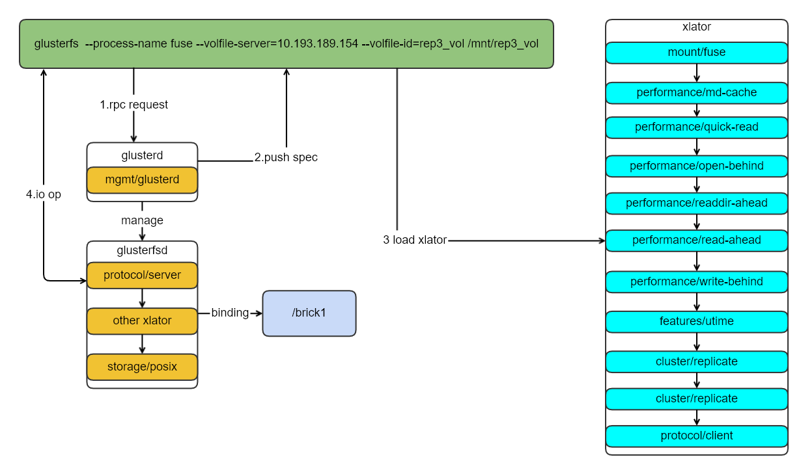

#### Glusterfs 原理
**Glusterfs 基本原理**
	Glusterfs 是基于fuse的分布式存储，功能上支持分布式/3副本/EC三种存储方式。Glusterfs采用堆栈式的架构设计，服务端和客户端采用translator.
	GlusterFS概念中，由一系列translator构成的完整功能栈称之为Volume，分配给一个volume的本地文件系统称为brick，被至少一个translator处理过的brick称为subvolume。客户端是由于volume类型来加载对应的translator，服务端也是一样，根据不同的volume的类型加载translator。客户端(glusterfs)通过挂载时候提供节点IP地址，很对应节点的服务端管理进程通信，获取brick源信息、客户单需要加载的配置，客户端根据配置初始化xlator，后续IO的流程按照xlator的顺序经过每个xlator的fop函数，然后直接和对应的glusterfsd的进程交互IO操作。glusterfsd也是一样，根据服务端配置文件，初始化服务端需要加载xlator，进行每个xlator的fop的操作，最终执行系统IO函数进行IO操作。节点的管理服务(glusterd),仅仅加载一个管理的xlator,处理来自glusterfs/gluster的请求，不会处理对应的IO操作操作。


#### Glusterfs环境

**1.Glusterfs版本**
```
glusterfs 7.5
```
**2.volume info**

```
Volume Name: rep3_vol
Type: Replicate
Volume ID: 73360fc2-e105-4fd4-9b92-b5fa333ba75d
Status: Started
Snapshot Count: 0
Number of Bricks: 1 x 3 = 3
Transport-type: tcp
Bricks:
Brick1: 10.193.189.153:/debug/glusterfs/rep3_vol/brick
Brick2: 10.193.189.154:/debug/glusterfs/rep3_vol/brick
Brick3: 10.193.189.155:/debug/glusterfs/rep3_vol/brick
Options Reconfigured:
diagnostics.brick-log-level: INFO
performance.client-io-threads: off
nfs.disable: on
storage.fips-mode-rchecksum: on
transport.address-family: inet
diagnostics.client-log-level: DEBUG
```

#### Mount 命令
**1.通过mount命令挂载**

```
mount -t glusterfs -o acl 10.193.189.153:/rep3_vol /mnt/rep3_vol2
```
**2.直接使用glusterfs二进制挂载**

```
 /usr/local/sbin/glusterfs --acl --process-name fuse --volfile-server=10.193.189.153 --volfile-id=rep3_vol /mnt/rep3_vol

```
#### Mount Glusterfs 整个流程

##### Glusterfs 交互架构



##### Glusterfs 客户端实现分析
- 1.glusterfsd.c中的main方法入口函数
```
int main(int argc, char *argv[])
{
	create_fuse_mount(ctx);
	glusterfs_volumes_init(ctx);
}
```
- 2.create_fuse_mount初始化mount/fuse的模块，具体是加载/usr/local/lib/glusterfs/2020.05.12/xlator/mount/fuse.so,会去执行fuse.so中的init方法
```
int create_fuse_mount(glusterfs_ctx_t *ctx)
{
	xlator_set_type(master, "mount/fuse")
	xlator_init(master);
}
```
- 3.加载glusterfs fuse模块以后会去执行 glusterfs_volumes_init，该函数主要是在客户端初始化针对客户端操作的volume需要的xlator.
```
int glusterfs_volumes_init(glusterfs_ctx_t *ctx)
{
   
    glusterfs_mgmt_init(ctx);
    glusterfs_process_volfp(ctx, fp);
}
```

- 4.针对我们参数传递的volfile_server为某个节点的ip,代码会走到glusterfs_mgmt_init，该函数会根据连接请求去fetch spec
```
int glusterfs_mgmt_init(glusterfs_ctx_t *ctx)
{
	rpc_clnt_register_notify(rpc, mgmt_rpc_notify, THIS);
	rpcclnt_cbk_program_register(rpc, &mgmt_cbk_prog, THIS);
    ctx->notify = glusterfs_mgmt_notify;
    ret = rpc_clnt_start(rpc);
}
static int mgmt_rpc_notify(struct rpc_clnt *rpc, void *mydata, rpc_clnt_event_t event,
                void *data)
{
 switch (event) {
        case RPC_CLNT_DISCONNECT:
        //
        case RPC_CLNT_CONNECT:
            ret = glusterfs_volfile_fetch(ctx);
}
//spec 信息如下参见附件
```
- 5. glusterfs_volfile_fetch 会调用glusterfs_volfile_fetch_one 获取spec

```
int glusterfs_volfile_fetch(glusterfs_ctx_t *ctx)
{
	return glusterfs_volfile_fetch_one(ctx, ctx->cmd_args.volfile_id);   
}
```
- 6.glusterfs_volfile_fetch_one是实质获取客户端brick元数据和translator的函数、同时通过mgmt_getspec_cbk回调函数处理获取这些信息后的处理函数
```
static int glusterfs_volfile_fetch_one(glusterfs_ctx_t *ctx, char *volfile_id)
{
 ret = mgmt_submit_request(&req, frame, ctx, &clnt_handshake_prog,
                              GF_HNDSK_GETSPEC, mgmt_getspec_cbk,
                              (xdrproc_t)xdr_gf_getspec_req);
}
//mgmt_submit_request函数会调用服务端的gluster_handshake_actors[GETSPEC]对应的函数，获取spec信息后会调用mgmt_getspec_cbk回调函数.
//在gdb参数中设置--volfile-server=10.193.189.154 这个节点上gdb attach glusterd进程，然后设置在server_getspec，然后客户端请求，然后10.193.189.154节点的glusterd在server_getspec响应
rpcsvc_actor_t gluster_handshake_actors[GF_HNDSK_MAXVALUE] = {
    [GF_HNDSK_GETSPEC] = {"GETSPEC", GF_HNDSK_GETSPEC, server_getspec, NULL, 0, DRC_NA}
};

//重新获取spec初始化客户端的translator的，这个函数就是构造xlator的图，同时初始化每个xlator
int
mgmt_getspec_cbk(struct rpc_req *req, struct iovec *iov, int count,
                 void *myframe)
{
 glusterfs_volfile_reconfigure(tmpfp, ctx);
 glusterfs_process_volfp(ctx, tmpfp);
}
```
####  Debug方法

**1.调试的注意点**
	glusterfs/glusterd/glusterfsd是同一个二进制进程，仅仅是区别是glusterfsd和glusterfs软链了glusterd的进程。glusterfs使用同一个二进制程序，根据不同的业务功能，fork或者走不同逻辑分别来实现glusterfs/glusterfsd/glusterd的功能。

**2.调试的注意点**

**3.具体调试方法**

- 1.执行命令gdb /usr/local/sbin/glusterfs
- 2.进入gdb的交互控制界面，需要设置参数,参数设置如下
```
gdb /usr/local/sbin/glusterfs
set args  --acl --process-name fuse --volfile-server=10.193.189.153 --volfile-id=rep3_vol /mnt/rep3_vol
(gdb) set print pretty on
(gdb) br main
(gdb) br create_fuse_mount  
```
- 3.当断点执行到create_fuse_mount，该函数通过xlator_init加载mount/fuse的translor。
```
(gdb) 
Detaching after fork from child process 37741.
Breakpoint 3, create_fuse_mount (ctx=0x63e010) at glusterfsd.c:719
//中间过程
(gdb) 
Detaching after fork from child process 39472.
770         if (ret) {
			}
```
- 4.等create_fuse_mount执行完毕以后，需要设置调试进程的模式,这样不至于进程一致停留在父进程中，子进程是需要和调试参数中设置的ip的节点通信，获取相关的bricks信息和客户端需要加载的translator
```
Detaching after fork from child process 39472.
770         if (ret) {//}
(gdb) set follow-fork-mode child 
(gdb)  set detach-on-fork off
(gdb) 
main (argc=7, argv=0x7fffffffe368) at glusterfsd.c:2875
2875        if (ret)
(gdb) 
2878        ret = daemonize(ctx);
(gdb) 
[New process 39570]
[Thread debugging using libthread_db enabled]
Using host libthread_db library "/lib64/libthread_db.so.1".
[New Thread 0x7fffeee4d700 (LWP 39573)]
[New Thread 0x7fffee64c700 (LWP 39574)]
[Switching to Thread 0x7ffff7fe74c0 (LWP 39570)]
main (argc=7, argv=0x7fffffffe368) at glusterfsd.c:2879
2879        if (ret)
Missing separate debuginfos, use: debuginfo-install glibc-2.17-260.el7_6.3.x86_64 libuuid-2.23.2-59.el7.x86_64 openssl-libs-1.0.2k-16.el7.x86_64 zlib-1.2.7-18.el7.x86_64
(gdb) 
2887        mem_pools_init();
(gdb)   

(gdb) set print elements 0
(gdb) show print elements 
```
- 5.在子进程设置glusterfs客户端执行逻辑的函数,通过rpc请求，向服务端glusterd拉取bricks元数据和客户端需要加载的translator的信息
```
(gdb) mgmt_getspec_cbk  
(gdb) glusterfs_volfile_fetch_one
(gdb) glusterfs_volfile_fetch 
(gdb) glusterfs_mgmt_init
(gdb) glusterfs_volumes_init
(gdb) glusterfs_process_volfp
(gdb) glusterfs_graph_construct

```
####  附件

```
volume rep3_vol-client-0
    type protocol/client
    option send-gids true
    option transport.socket.keepalive-count 9
    option transport.socket.keepalive-interval 2
    option transport.socket.keepalive-time 20
    option transport.tcp-user-timeout 0
    option transport.socket.ssl-enabled off
    option password 7e9a1877-0837-4563-b73d-aa4cde754c91
    option username bdb0a45d-e70d-445d-8fe6-76118dfdb738
    option transport.address-family inet
    option transport-type tcp
    option remote-subvolume /debug/glusterfs/rep3_vol/brick
    option remote-host 10.193.189.153
    option ping-timeout 42
end-volume

volume rep3_vol-client-1
    type protocol/client
    option send-gids true
    option transport.socket.keepalive-count 9
    option transport.socket.keepalive-interval 2
    option transport.socket.keepalive-time 20
    option transport.tcp-user-timeout 0
    option transport.socket.ssl-enabled off
    option password 7e9a1877-0837-4563-b73d-aa4cde754c91
    option username bdb0a45d-e70d-445d-8fe6-76118dfdb738
    option transport.address-family inet
    option transport-type tcp
    option remote-subvolume /debug/glusterfs/rep3_vol/brick
    option remote-host 10.193.189.154
    option ping-timeout 42
end-volume

volume rep3_vol-client-2
    type protocol/client
    option send-gids true
    option transport.socket.keepalive-count 9
    option transport.socket.keepalive-interval 2
    option transport.socket.keepalive-time 20
    option transport.tcp-user-timeout 0
    option transport.socket.ssl-enabled off
    option password 7e9a1877-0837-4563-b73d-aa4cde754c91
    option username bdb0a45d-e70d-445d-8fe6-76118dfdb738
    option transport.address-family inet
    option transport-type tcp
    option remote-subvolume /debug/glusterfs/rep3_vol/brick
    option remote-host 10.193.189.155
    option ping-timeout 42
end-volume

volume rep3_vol-replicate-0
    type cluster/replicate
    option use-compound-fops off
    option afr-pending-xattr rep3_vol-client-0,rep3_vol-client-1,rep3_vol-client-2
    subvolumes rep3_vol-client-0 rep3_vol-client-1 rep3_vol-client-2
end-volume

volume rep3_vol-dht
    type cluster/distribute
    option force-migration off
    option lock-migration off
    subvolumes rep3_vol-replicate-0
end-volume

volume rep3_vol-utime
    type features/utime
    option noatime on
    subvolumes rep3_vol-dht
end-volume

volume rep3_vol-write-behind
    type performance/write-behind
    subvolumes rep3_vol-utime
end-volume

volume rep3_vol-read-ahead
    type performance/read-ahead
    subvolumes rep3_vol-write-behind
end-volume

volume rep3_vol-readdir-ahead
    type performance/readdir-ahead
    option rda-cache-limit 10MB
    option rda-request-size 131072
    option parallel-readdir off
    subvolumes rep3_vol-read-ahead
end-volume

volume rep3_vol-io-cache
    type performance/io-cache
    subvolumes rep3_vol-readdir-ahead
end-volume

volume rep3_vol-open-behind
    type performance/open-behind
    subvolumes rep3_vol-io-cache
end-volume

volume rep3_vol-quick-read
    type performance/quick-read
    subvolumes rep3_vol-open-behind
end-volume

volume rep3_vol-md-cache
    type performance/md-cache
    subvolumes rep3_vol-quick-read
end-volume

volume rep3_vol
    type debug/io-stats
    option global-threading off
    option count-fop-hits off
    option latency-measurement off
    option threads 16
    option log-level DEBUG
    subvolumes rep3_vol-md-cache
end-volume
```


