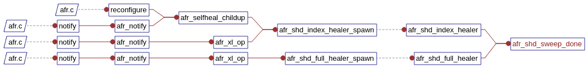

##  Gluster Self-Heal如何工作的？

| 作者 | 时间 |QQ技术交流群 |
| ------ | ------ |------ |
| perrynzhou@gmail.com |2020/12/01 |672152841 |
### Gluster Shd进程介绍

- glusterfs shd进程的主要职责是修复副本卷和EC卷的数据，shd存在于每个gluster集群的节点中(如果开启heal)，不是基于卷的。比如一个节点既部署了副本的brick，同时也部署了ec的brick，基本就一个shd进程

- glusterfs  shd进程会加载io-stats这个xlator，这个xlator的孩子可以是副本卷的xlator,也可以是ec卷的xlator.如果展示了glustershd的加载的xlator

  ````
   // EC卷的第一个glusterfsd
   volume ec-vol-client-0
       type protocol/client
       option ping-timeout 42
       option remote-host 172.16.84.37
       option remote-subvolume /data/ec/brick
   end-volume
   // EC卷的第二个glusterfsd
   volume ec-vol-client-1
       type protocol/client
       option ping-timeout 42
       option remote-host 172.16.84.41
       option remote-subvolume /data/ec/brick
   end-volume
  
  // EC卷的sglusterfsd的集合
   volume ec-vol-disperse-0
       type cluster/disperse
       option redundancy 1
       option self-heal-daemon enable
       option iam-self-heal-daemon yes
       subvolumes ec-vol-client-0 ec-vol-client-1 ec-vol-client-2
   end-volume
   
   // io-stats的xlator
   volume ec-vol
     type debug/io-stats
     option log-level INFO
     option threads 16
     subvolumes ec-vol-disperse-0
   end-volume
  ````

  ```
  Volume Name: ec-vol
  Type: Disperse
  Volume ID: 8ab95850-a90f-4e1d-b7f4-5932c52f7dce
  Status: Started
  Snapshot Count: 0
  Number of Bricks: 1 x (2 + 1) = 3
  Transport-type: tcp
  Bricks:
  Brick1: 172.16.84.37:/data/ec/brick
  Brick2: 172.16.84.41:/data/ec/brick
  Brick3: 172.16.84.42:/data/ec/brick
  Options Reconfigured:
  cluster.disperse-self-heal-daemon: enable
  storage.fips-mode-rchecksum: on
  transport.address-family: inet
  nfs.disable: on
  ```
- shd进程有两种self-heal crawls,一种是index heal,另外一种是full heal.每个文件在crawling时候，会执行metadata、data、entry的修复。metadata修复文件的属性、权限、mode。data的修复会修复文件内容;entry修复会修复entry里面的目录

### Index Heal

##### 触发的条件
- glusterfs中一般会有三种情况会触发index heal

  ```c
  1.每隔60s会触发一次，可以通过gluster volume xxx set cluster.heal-timeout {value}来设置
  2.当客户端执行gluster volume heal {volume}会触发
  3.当副本卷所在节点或者glusterfsd宕机后，又再次恢复过来会触发
  
  ```

  在一个时间段内只会有一个shd进程来做修复。当此次shd修复完成后才可以触发shd进程进行下一次的修复，没完成之前会把请求进入队列。如果在cli执行了gluster volume heal {volume}后，此次修复没有完成，再次执行gluster volume heal {volume} full,只有等上一次完成之后才能进行full的修复

##### 如何做Index Heal?
- 在index heal逻辑里面，gluster shd进程读取每个brick下的.glusterfs/indices/xattrop这个目录下的目录，加锁触发修复。.glusterfs/indices/xattrop目录中包含了以"xattrop-"开头的目录。这个目录下的其他木库是以gfid开头的，这些是需要修复的数据

  ```c
  //在节点2上干掉一个glusterfsd进程
  [root@node2 ~]# ps -ef|grep glusterfsd
  root     1401177       1  1 10:54 ?        00:03:15 /usr/local/sbin/glusterfsd -s 172.16.84.41 --volfile-id replica-vol.172.16.84.41.data-replica-brick -p /var/run/gluster/vols/replica-vol/172.16.84.41-data-replica-brick.pid 
  [root@node2 ~]# kill -9 1401177
  
  // 节点1 上挂载然后，拷贝文件到这个卷中
  [root@node1 glusterfs]#  mount -t glusterfs 172.16.84.37:replica-vol /mnt/rep/
  [root@node1 glusterfs]# cp cmd_history.log  /mnt/rep/
  
  // 然后发现这个卷下有2个文件 xattrop-22a5abc0-b16c-497e-b882-18c2c3486c5e和300f383b-db21-412b-9a10-6d70fd80fa7d
  [root@node1 xattrop]# pwd
  /data/replica/brick/.glusterfs/indices/xattrop
  [root@node1 xattrop]# ls -l
  total 0
  ---------- 3 root root 0 Mar 11 10:57 00000000-0000-0000-0000-000000000001
  ---------- 3 root root 0 Mar 11 10:57 300f383b-db21-412b-9a10-6d70fd80fa7d
  ---------- 3 root root 0 Mar 11 10:57 xattrop-22a5abc0-b16c-497e-b882-18c2c3486c5e
  ```

- 当客户端对这个cmd_history.log 文件进行操作请求发送到glusterfsd处理时候，在features/index这个xlator处理时候会添加硬链接在fop的pre-op事务处理阶段，如果修复处理成功也会删除硬链接在post-op处理阶段。因此当在.glusterfs/indices/xattrop目录中的没有IO操作的时候，对.glusterfs/indices/xattrop下面的文件进行修复，修复的逻辑如下

  ```
  //修复过程
  In shd process of each node {
          opendir +readdir (.glusterfs/indices/xattrop)
          for each entry inside it {
                  self_heal_entry() //Explained below.
          }
  }
  
  self_heal_entry() {
          Call syncop_lookup(replicae subvolume) which eventually does {
                  take appropriate locks
                  determine source and sinks from AFR changelog xattrs    
                  perform whatever heal is needed (any of metadata, data and entry heal in that order)
                  clear changelog xattrs and hardlink inside .glusterfs/indices/xattrop
          }
  }
  ```

  ```
  // features/index xlator的信息
  volume replica-vol-index
    type features/index
    option index-base /data/replica/brick/.glusterfs/indices
    option xattrop-dirty-watchlist trusted.afr.dirty
    option xattrop-pending-watchlist trusted.afr.replica-vol-
    subvolumes replica-vol-barrier
  end-volume
  ```

- 当gfid 的硬链接在副本卷的中2个副本的brick存在 .glusterfs/indices/xattrop，它会基于domain lock一个一个修复。当某个文件或者目录的父目录没有没有被修复，会跳过继续修复可以修复的文件或者目录。
- 如果一个文件出现data或者metadata出现脑裂，这些文件是不需要被修复的。
### Full Heal

- 当在cli执行gluster volume heal {volume} full,会触发Full heal。这个命令比较粗暴，直接从健康的brick拷贝数据到被修复的brick.

- 这个和index heal修复模式不同，gluster集群中每个节点都有一个uuid.选择uuid最大的.也是最新最健康的的brick源端的数据源，选择后数据搬运到待修复的brick上.基本的修复逻辑如下

```
In shd process of highest UUID node per replica {
          opendir +readdir ("/")
          for each entry inside it {
                  self_heal_entry()
                  if (entry == directory) {
                          / Recurse/
                          again opendir+readdir (directory) followed by self_heal_entry() of each entry.
                  }
  
}
```

#### Gluster 修复的核心函数调用




#### 测试环境

- replica 卷

  ```
  
  [root@node1 ~]# gluster volume info
  Volume Name: replica-vol
  Type: Replicate
  Volume ID: dc294dff-7adb-46dd-a081-92b3a54d476e
  Status: Started
  Snapshot Count: 0
  Number of Bricks: 1 x 3 = 3
  Transport-type: tcp
  Bricks:
  Brick1: 172.16.84.37:/data/replica/brick
  Brick2: 172.16.84.41:/data/replica/brick
  Brick3: 172.16.84.42:/data/replica/brick
  Options Reconfigured:
  cluster.self-heal-daemon: enable
  storage.reserve: 99
  cluster.granular-entry-heal: on
  storage.fips-mode-rchecksum: on
  transport.address-family: inet
  nfs.disable: on
  performance.client-io-threads: off
  
  // 启动每个volume的shd进程
  [root@node1 ~]# gluster volume status replica-vol
  Status of volume: replica-vol
  Gluster process                             TCP Port  RDMA Port  Online  Pid
  ------------------------------------------------------------------------------
  Brick 172.16.84.37:/data/replica/brick      49152     0          Y       1511816
  Brick 172.16.84.41:/data/replica/brick      49152     0          Y       1401177
  Brick 172.16.84.42:/data/replica/brick      49152     0          Y       2731653
  Self-heal Daemon on localhost               N/A       N/A        Y       1511833
  Self-heal Daemon on 172.16.84.41            N/A       N/A        Y       1401194
  Self-heal Daemon on 172.16.84.42            N/A       N/A        Y       2731670
   
  Task Status of Volume replica-vol
  ------------------------------------------------------------------------------
  There are no active volume tasks
  ```

  

- ec 卷

  ```
  [root@node1 ~]# gluster volume info 
  Volume Name: ec-vol
  Type: Disperse
  Volume ID: 8ab95850-a90f-4e1d-b7f4-5932c52f7dce
  Status: Started
  Snapshot Count: 0
  Number of Bricks: 1 x (2 + 1) = 3
  Transport-type: tcp
  Bricks:
  Brick1: 172.16.84.37:/data/ec/brick
  Brick2: 172.16.84.41:/data/ec/brick
  Brick3: 172.16.84.42:/data/ec/brick
  Options Reconfigured:
  cluster.disperse-self-heal-daemon: enable
  storage.fips-mode-rchecksum: on
  transport.address-family: inet
  nfs.disable: on
  
  [root@node1 ~]# gluster volume status ec-vol
  Status of volume: ec-vol
  Gluster process                             TCP Port  RDMA Port  Online  Pid
  ------------------------------------------------------------------------------
  Brick 172.16.84.37:/data/ec/brick           49153     0          Y       1569574
  Brick 172.16.84.41:/data/ec/brick           49153     0          Y       1456710
  Brick 172.16.84.42:/data/ec/brick           49153     0          Y       2833998
  Self-heal Daemon on localhost               N/A       N/A        Y       1511833
  Self-heal Daemon on 172.16.84.41            N/A       N/A        Y       1401194
  Self-heal Daemon on 172.16.84.42            N/A       N/A        Y       2731670
   
  Task Status of Volume ec-vol
  ------------------------------------------------------------------------------
  There are no active volume tasks
   
  ```

  

- 节点进程运行信息

  ```
  // 每个节点运行1个shd进程
  [root@node1 ~]# ps -ef|grep -v grep |grep glustershd 
  root     1578547       1  0 11:46 ?        00:00:00 /usr/local/sbin/glusterfs -s localhost --volfile-id shd/ec-vol -p /var/run/gluster/shd/ec-vol/ec-vol-shd.pid -l /var/log/glusterfs/glustershd.log -S /var/run/gluster/6cf91972718c43a8.socket --xlator-option *replicate*.node-uuid=a37ce536-32de-4829-9d7d-3f3a5ca83ef7 --process-name glustershd --client-pid=-6
  ```

  

  