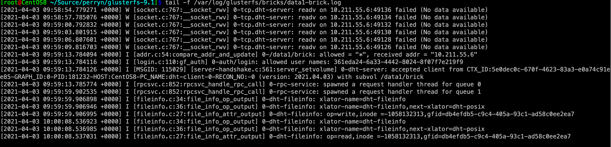

## Glusterfs Xlator开发详解

| 作者 | 时间 |QQ技术交流群 |
| ------ | ------ |------ |
| perrynzhou@gmail.com |2021/03/27 |672152841 |

#### 开发环境

- 目前版本基于glusterfs 9.1实现
- gcc版本为8

#### 服务端xlator开发流程

#####  开发fileinfo xlator
- 根据读写类型，输出当前xlator的名称
- 根据读类型，输出当前文件的inode和gfid

##### fileinfo xlator的实现
- fileinfo.h
```
#ifndef __FILE_INFO_H__
#define __FILE_INFO_H__

typedef struct {
    gf_boolean_t fileinfo;
} fileinfo_private_t;

```
- fileinfo.c
```
#include <ctype.h>
#include <sys/uio.h>

#include <glusterfs/glusterfs.h>
#include <glusterfs/xlator.h>
#include <glusterfs/logging.h>

#include "fileinfo.h"
// 定义操作类型
static char *op[2] = {
    "write",
    "read"
};

// 把当前操作对象的gfid打印出来，同时打印出操作类型
void
file_info_attr_output(xlator_t *this,struct iatt *st,int op_type)
{
    char *info = (char *)calloc(64,sizeof(char));
    uuid_unparse(st->ia_gfid,info);
    gf_log (this->name, GF_LOG_INFO,"op=%s,inode =%d,gfid=%s",op[op_type],st->ia_ino,info);
    free(info);
}
// 输出当前xlator的名称
void
file_info_op_output(call_frame_t *frame, xlator_t *this)
{
   
    gf_log (this->name, GF_LOG_INFO,"xlator-name=%s",this->name);
    if(this->next!=NULL) {
        gf_log (this->name, GF_LOG_INFO,"xlator-name=%s,next-xlator=%s",this->name,this->next->name);
    }
}
// fileinfo xlator的read的回调回调函数
int32_t
fileinfo_readv_cbk(call_frame_t *frame, void *cookie, xlator_t *this,
                int32_t op_ret, int32_t op_errno, struct iovec *vector,
                int32_t count, struct iatt *stbuf, struct iobref *iobref,
                dict_t *xdata)
{
	  // 此处打印gfid和操作类型
    file_info_attr_output(this,stbuf,1);
    // 调用上一个xlator的回调函数
    STACK_UNWIND_STRICT(readv, frame, op_ret, op_errno, vector, count, stbuf,
                        iobref, xdata);
    return 0;
}

// fileinfo的read的实现
int32_t
fileinfo_readv(call_frame_t *frame, xlator_t *this, fd_t *fd, size_t size,
            off_t offset, uint32_t flags, dict_t *xdata)
{
    // 输出当前xlator的名称
    file_info_op_output(frame,this);
		//执行fileinfo相关的读函数，同时往下一个xlator传递当前xaltor的回调函数
    STACK_WIND(frame, fileinfo_readv_cbk, FIRST_CHILD(this),
               FIRST_CHILD(this)->fops->readv, fd, size, offset, flags, xdata);
    return 0;
}

// fileinfo的写操作的回调函数
int32_t
fileinfo_writev_cbk(call_frame_t *frame, void *cookie, xlator_t *this,
                 int32_t op_ret, int32_t op_errno, struct iatt *prebuf,
                 struct iatt *postbuf, dict_t *xdata)
{
		
    // 输出当前操作文件的gfid和操作类型
    file_info_attr_output(this,prebuf,0);
    // 根据frame调用父xlator的回调函数
    STACK_UNWIND_STRICT(writev, frame, op_ret, op_errno, prebuf, postbuf,
                        xdata);
    return 0;
}

// fileinfo的写函数实现
int32_t
fileinfo_writev(call_frame_t *frame, xlator_t *this, fd_t *fd,
             struct iovec *vector, int32_t count, off_t offset, uint32_t flags,
             struct iobref *iobref, dict_t *xdata)
{
		// 获取当前xlator的priv数据
    fileinfo_private_t *priv = (fileinfo_private_t *)this->private;
    // 输出当前xlator的相关信息
    file_info_op_output(frame,this);
    // 调用下一个xlator的功能
    STACK_WIND(frame, fileinfo_writev_cbk, FIRST_CHILD(this),
               FIRST_CHILD(this)->fops->writev, fd, vector, count, offset,
               flags, iobref, xdata);
    return 0;
}


// fileinfo xlator的初始化
int32_t
fileinfo_init(xlator_t *this)
{
    int ret = -1;
    data_t *data = NULL;
    fileinfo_private_t *priv = NULL;

    if (!this->children || this->children->next) {
        gf_log("fileinfo", GF_LOG_ERROR,
               "FATAL: fileinfo should have exactly one child");
        return -1;
    }

    if (!this->parents) {
        gf_log(this->name, GF_LOG_WARNING, "dangling volume. check volfile ");
    }

    priv = GF_CALLOC(sizeof(fileinfo_private_t), 1, 0);
    if (!priv)
        return -1;

    GF_OPTION_INIT("fileinfo", priv->fileinfo, bool, out);

    data = dict_get(this->options, "fileinfo");
    if (data) {
        if (gf_string2boolean(data->data, &priv->fileinfo) == -1) {
            gf_log(this->name, GF_LOG_ERROR,
                   "fileinfo takes only boolean options");
            GF_FREE(priv);
            return -1;
        }
    }
    this->private = priv;
    gf_log("fileinfo", GF_LOG_DEBUG, "fileinfo xlator loaded");
    return 0;
out:
    return ret;
}

// fileinfo 的销毁函数
void
fileinfo_fini(xlator_t *this)
{
    fileinfo_private_t *priv = this->private;

    if (!priv)
        return;
    this->private = NULL;
    GF_FREE(priv);

    return;
}

// 当重新配置storge.fileinfo,会自动加载这个函数，重新配置当前xlator的fileinfo的变量
int
fileinfo_reconfigure(xlator_t *this, dict_t *options)
{
    int ret = -1;
    gf_boolean_t fileinfo = _gf_false;
    fileinfo_private_t *priv = NULL;
    priv = this->private;
    GF_OPTION_RECONF("fileinfo", fileinfo, options, bool, out);  
    priv->fileinfo = fileinfo;
    ret = 0;
out:
    return ret;
}

// 内存相关函数
int32_t
mem_acct_init(xlator_t *this)
{
    int ret = -1;

    if (!this)
        return ret;

    ret = xlator_mem_acct_init(this, 128 + 1);

    if (ret != 0) {
        return ret;
    }

    return ret;
}

// 定义当前xlator的fops的操作，这个符合文件的posix的语义
struct xlator_fops fops = { 
        .readv          = fileinfo_readv,
        .writev         = fileinfo_writev
};

// xlator的回调函数实现
struct xlator_cbks cbks;

// 当前xlator的可以配置的变量，这里是fileinfo的变量，表示是否启用fileinfo的xlator
struct volume_options fileinfo_options[] = {
       {.key = {"fileinfo"},
     .type = GF_OPTION_TYPE_BOOL,
     .default_value = "on",
     .description = "test fileinfo",
     .op_version = {1},
     // 这里flag表示可以配置
     .flags = OPT_FLAG_SETTABLE | OPT_FLAG_DOC},
    {.key = {NULL}},
};

// 定义当前xlator的实现
xlator_api_t xlator_api = {
    .init = fileinfo_init,
    .fini = fileinfo_fini,
    .reconfigure = fileinfo_reconfigure,
    .mem_acct_init = mem_acct_init,
    .op_version = {1}, /* Present from the initial version */
    .fops = &fops,
    .cbks = &cbks,
    .options = fileinfo_options,
    .identifier = "fileinfo",
    .category = GF_MAINTAINED,
};
```
- 通过glusterd来禁用或者启用fileinfo xlator

```
// 需要在glusterfs/xlator/mgmt/glusterd/src/glusterd-volume-set.c中glusterd_volopt_map添加如下内容
struct volopt_map_entry glusterd_volopt_map[] = {
    {.key = "cluster.lookup-unhashed",
     .voltype = "cluster/distribute",
     .op_version = 1,
     .flags = VOLOPT_FLAG_CLIENT_OPT},
     // -------忽略-------------
     // 这里定义fileinfo的可配置参数为storage.fileinfo,storage意思是位于glusterfs/xlator/storage的目录下,这个storage.fileinfo是获取fileinfo xlator中fileinfo_options中的fileinfo，glusterd根据是否开启storage.fileinfo给glusterfsd来推送volume graph，来进行加载
     {
        .key = "storage.fileinfo", 
        .voltype = "storage/fileinfo", 
        .value = "on",
        .op_version = 1,
        .op_version = GD_OP_VERSION_8_0,
    },

}
```
- 在glusterfsd配置默认加载fileinfo xlator（如果不做如下修改，默认不加载)

```
// 需要在glusterfs/xlator/mgmt/glusterd/src/glusterd-volume-set.c中找到server_graph_table，添加fileinfo  xlator,server_graph_table中定义的顺序也是glusterd启动glusterfsd的Graph的顺序
static volgen_brick_xlator_t server_graph_table[] = {
    {brick_graph_add_server, NULL},
    {brick_graph_add_io_stats, "NULL"},
    // -------忽略其他----------
    //这里定义fileinfo xlator的加载方式和加载函数
    {brick_graph_add_fileinfo, "fileinfo"}
    {brick_graph_add_posix, "posix"},

};

// 定义brick_graph_add_fileinfo加载函数，在创建卷后，会自动创建
static int
brick_graph_add_fileinfo(volgen_graph_t *graph, glusterd_volinfo_t *volinfo,
                        dict_t *set_dict, glusterd_brickinfo_t *brickinfo)
{
    xlator_t *xl = NULL;
    char *fileinfo_enable = NULL;
    int ret = -1;
    xlator_t *this = THIS;
    GF_ASSERT(this);

    if (!graph || !volinfo) {
        gf_smsg(this->name, GF_LOG_ERROR, errno, GD_MSG_INVALID_ARGUMENT, NULL);
        goto out;
    }

    xl = volgen_graph_add(graph, "storage/fileinfo", volinfo->volname);
    if (!xl)
        goto out;
    return 0;
out:
    return ret;
}


// 最终是通过  server_graph_builder 函数来构建服务端glusterfsd运行的xlator图
```

##### fileinfo xlator的配置
- fileinfo实现放到glusterfs/xlator/storage下面
```
[root@CentOS8 ~/Source/perryn/glusterfs-9.1/xlators]$ ls
cluster  debug  features  lib  Makefile  Makefile.am  Makefile.in  meta  mgmt  mount  nfs  performance  playground  protocol  storage  system  xlator.sym
[root@CentOS8 ~/Source/perryn/glusterfs-9.1/xlators]$ cd storage/
[root@CentOS8 ~/Source/perryn/glusterfs-9.1/xlators/storage]$ tree fileinfo/
fileinfo/
├── Makefile
├── Makefile.am
├── Makefile.in
└── src
    ├── fileinfo.c
    ├── fileinfo.h
    ├── Makefile
    ├── Makefile.am
    └── Makefile.in

[root@CentOS8 ~/Source/perryn/glusterfs-9.1/xlators/storage]$ 
```
- 编辑fileinfo/src/Makefile.am
```
xlator_LTLIBRARIES = fileinfo.la
xlatordir = $(libdir)/glusterfs/$(PACKAGE_VERSION)/xlator/storage

fileinfo_la_LDFLAGS = -module $(GF_XLATOR_DEFAULT_LDFLAGS)

fileinfo_la_SOURCES = fileinfo.c
fileinfo_la_LIBADD = $(top_builddir)/libglusterfs/src/libglusterfs.la

noinst_HEADERS = fileinfo.h

AM_CPPFLAGS = $(GF_CPPFLAGS) -I$(top_srcdir)/libglusterfs/src \
	-I$(top_srcdir)/rpc/xdr/src -I$(top_builddir)/rpc/xdr/src

AM_CFLAGS = -Wall $(GF_CFLAGS)

CLEANFILES =

```
- 编辑fileinfo/Makefile.am
```
SUBDIRS = src

CLEANFILES = 
```
-  编辑storage/Makefile.am

```
// 原来只有SUBDIRS =  posix，更改为如下
SUBDIRS = fileinfo posix

CLEANFILES =
```
- 编辑glusterfs/configure.ac文件

```
// 找到AC_CONFIG_FILES([Makefile.......),在storage添加如下内容
AC_CONFIG_FILES([Makefile
                libglusterfs/Makefile
                libglusterfs/src/Makefile
 								xlators/storage/Makefile
 								//--------忽略------------
                xlators/storage/posix/Makefile
                //配置fileinfo的Makefile和fileinfo/src的Makefile
                xlators/storage/fileinfo/Makefile
                xlators/storage/fileinfo/src/Makefile
                 //--------忽略------------
                xlators/storage/posix/src/Makefile
                tools/setgfid2path/src/Makefile])

AC_CANONICAL_HOST
```
##### fileinfo xlator的编译

```
[root@CentOS8 ~/Source/perryn/glusterfs-9.1]$ ./autogen.sh&&CFLAGS="-ggdb3 -O0"  ./configure  --enable-debug --disable-linux-io_uring&& make -j64 && make install
```

##### 创建dht卷

```
[root@CentOS8 ~/Source/perryn/glusterfs-9.1]$ gluster volume create dht 10.211.55.6:/data1/brick force
[root@CentOS8 ~/Source/perryn/glusterfs-9.1]$ gluster volume start dht
```

##### 查看brick的volume

```
volume dht-posix
    type storage/posix
    option glusterd-uuid 0ac18ba3-f4ef-488d-90d5-2878c980daaf
    option directory /data1/brick
    option volume-id 04c5ec98-16fc-4eee-bf98-497d85a98df0
    option fips-mode-rchecksum on
    option shared-brick-count 1
end-volume

volume dht-fileinfo
    type storage/fileinfo
    subvolumes dht-posix
end-volume

volume dht-trash
    type features/trash
    option trash-dir .trashcan
    option brick-path /data1/brick
    option trash-internal-op off
    subvolumes dht-fileinfo
end-volume

// -------忽略其他
volume dht-server
    type protocol/server
    option transport.socket.listen-port 49152
    option rpc-auth.auth-glusterfs on
    option rpc-auth.auth-unix on
    option rpc-auth.auth-null on
    option rpc-auth-allow-insecure on
    option transport-type tcp
    option transport.address-family inet
    option auth.login./data1/brick.allow 341ed5c6-925c-48c2-86bf-8efe5ef6bbde
    option auth.login.341ed5c6-925c-48c2-86bf-8efe5ef6bbde.password 320c83cb-46bb-41e0-9d73-f916544af767
    option auth-path /data1/brick
    option auth.addr./data1/brick.allow *
    option transport.socket.keepalive 1
    option transport.socket.ssl-enabled off
    option transport.socket.keepalive-time 20
    option transport.socket.keepalive-interval 2
    option transport.socket.keepalive-count 9
    option transport.listen-backlog 1024
    subvolumes /data1/brick
end-volume
```

##### 客户端挂载和使用
- 挂载客户端
```
[root@CentOS8 ~]$ mount -t glusterfs 10.211.55.6:/dht /mnt/data1/
[root@CentOS8 ~]$ df -h
Filesystem           Size  Used Avail Use% Mounted on
devtmpfs             1.2G     0  1.2G   0% /dev
tmpfs                1.2G     0  1.2G   0% /dev/shm
tmpfs                1.2G  8.7M  1.2G   1% /run
tmpfs                1.2G     0  1.2G   0% /sys/fs/cgroup
/dev/mapper/cl-root   41G  4.5G   37G  11% /
/dev/sda1           1014M  257M  758M  26% /boot
/dev/mapper/cl-home   20G  174M   20G   1% /home
/dev/sdc              64G  490M   64G   1% /data1
10.211.55.6:/dht      64G  1.2G   63G   2% /mnt/data1
```

- 读写操作

  ```
  [root@CentOS8 ~]$ ls
  anaconda-ks.cfg  data1.txt  debug  open-cas-linux  Source
  // 写操作
  [root@CentOS8 ~]$ cp data1.txt  /mnt/data1/
  // 读操作
  [root@CentOS8 ~]$ cat /mnt/data1/data1.txt 
  aaaa
  [root@CentOS8 ~]$ 
  ```
  


​       读写操作会打印出当前xlator的名称和下一个xlator的名称，同时会在日志中打印操作类型，inod，gfid的信息

  