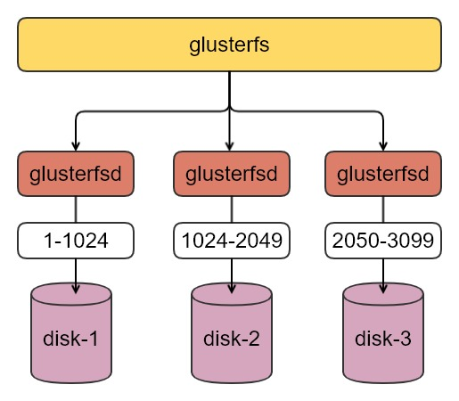
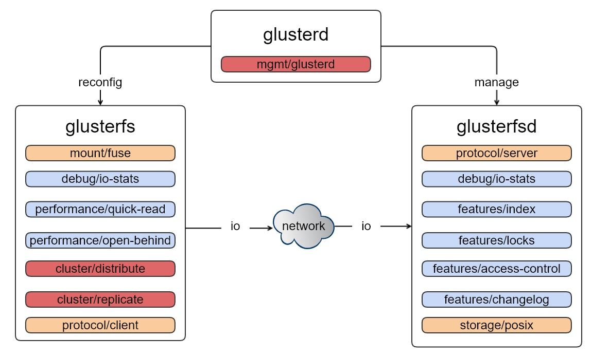

## Gluster分析

| 作者 | 时间 |QQ群 |
| ------ | ------ |------ |
| perrynzhou@gmail.com |2020/12/01 |672152841 |

#### Glusterfs介绍

- Glusterfs是一个分布式文件存储，通过多个主机磁盘聚合，对外提供统一的命令空间的存储文件存储服务。
- Glusterfs提供丰富的存储策略，支持无副本方式存储、N副本存储、EC存储，针对不同的应用场景提供不同的存储策略。
- Glusterfs整个架构采用堆栈插件实现，如果用户要实现自定义的功能，只需要实现自己需要的posix语义和对象你想要的功能即可，灵活性比较大。
- Glusterfs作为无中心架构，扩展性相对比较好。
- Glusterfs内部采用了弹性哈希算法，Glusterfs客户端针对每个文件在写入集群时候需要计算它父目录的layout和文件名的哈希值，然后选择一个glusterfsd进行写入.Glusterfs把需要计算的部分放到了客户端，Glusterfs服务端相对压力会比较好。

#### Glusterfs无中心架构



- glusterfs,作为fuse mount的服务，通过fuse xlator作为入口，通过glusterfs 客户端的dht xlator，最终通过protocol/client xlator,数据直接送到glusterfsd进行IO操作。其中上图中的白色框内，是每个glusterfsd负责的写入数据的哈希范围。这个设计和ceph有一些类似。glusterfs每个进程的服务，都包含了一堆的xaltor.



- glusterfs集群中每个进程服务都是由一组xlator来做对应的功能，每个请求都是从每个进程的中最上面一个xlator顺序执行到最后一个xlator,来实现本进程的工作,上图中的每个进程仅仅罗列了部分的xlator.glusterfs实现中客户端实现最重，体现在比较核心的三个模块，cluster/distribute、cluster/ec、cluster/replicate这三块，分别在客户端实现了哈希卷、EC卷、多副本卷的逻辑。每个客户端在使用mount时候会和glusterd通信获取到当前集群的拓扑信息，客户端通过弹性哈希算法来决定数据存储的位置，后续直接和对应的glusterfsd通信来完成IO

- glusterfs服务端，在glusterfs集群中体现在glusterfsd的进程，这里主要是数据读写的一些io thread、网络请求接受和发送、访问控制、锁、刷盘的操作的xlator集合。

- glusterd是glusterfs集群中管理进程，负责拉起glusterfsd服务、配置变更通知glusterfs客户端和glusterfsd，让他们各自根据变动来重新加载xlator.glusterd是通过读取glusterfs的集群配置来完成的，如下是glusterd加载的xaltor

  ```
  volume management
  	// 定义glusterd加载的xaltor,这里对应的是glusterfs源代码中的xlator的实现目录
      type mgmt/glusterd
      option rpc-auth.auth-glusterfs on
      option rpc-auth.auth-unix on
      option rpc-auth.auth-null on
      option rpc-auth-allow-insecure on
      option transport.listen-backlog 1024
      option max-port 60999
      option event-threads 1
      option ping-timeout 0
      option transport.socket.listen-port 24007
      option transport.socket.read-fail-log off
      option transport.socket.keepalive-interval 2
      option transport.socket.keepalive-time 10
      option transport-type socket
      // 这里是最核心的，是整个glusterfs集群的目录配置
      option working-directory /var/lib/glusterd
  end-volume
  ```

  


#### Glusterfs 实际工程中的使用心得

- glusterfs的稳定性不错，适合容量和带宽形的业务。
- glusterfs的可配置参数比较多，需要掌握一些核心参数的实现，这样对于运行原理和运维上会有很大的帮助
- glusterfs 的客户端实现比较重，大部分核心逻辑都在客户端，对于研发来说这块有很大的改进空间。
- 在实际的使用过程中，建议使用比较新的release版本，目前旧版的小问题比较多；如果有研发实力最好自己维护一个分支。
- glusterfs 目前社区活跃度还不错，但是周边生态做的比较差。

