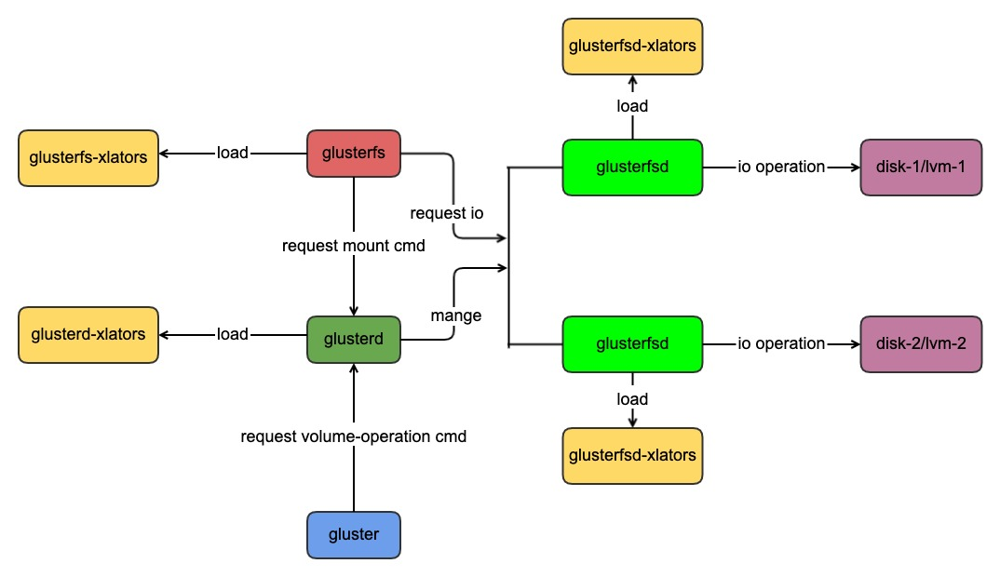
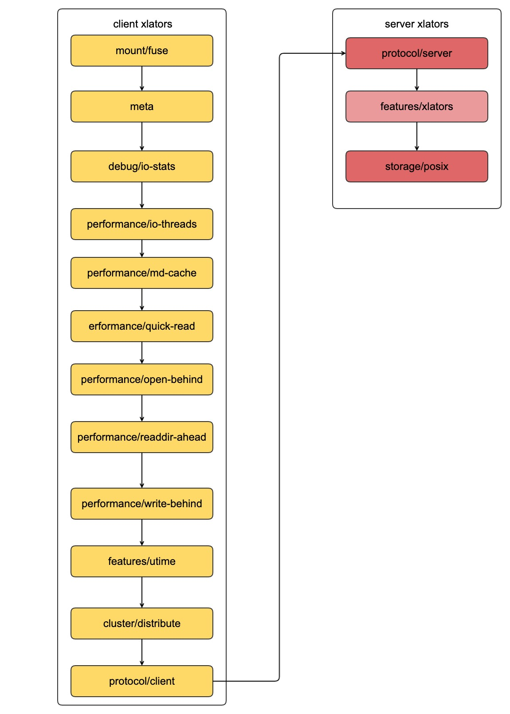

| 作者 | 时间 |QQ技术交流群 |
| ------ | ------ |------ |
| perrynzhou@gmail.com |2020/12/01 |中国开源存储技术交流群(672152841) |

## 架构介绍
  
### glusterfs的进程结构
- glusterfs :用于客户端挂在的进程
- glusterfsd:用于数据读写的进程
- glusterd:物理节点上的glusterfsd的管理进程，glusterd可以管理节点上一个或者多个glusterfsd的进程
- gluster:用于和glusterd管理进程通信的交互的命令行工具
  
### xlators说明
- glusterd-xlators:glusterd需要加载的xlator,默认加载mgnt/glusterd这个xaltor
- glusterfsd-xlators:glusterfsd数据读写进程需要加载的xlators,glusterfsd必须加载protocol/server和storage/posix这2个xlators,一个是glusterfsd进程接受网络请求，一个是接受请求以后进行数据读写。
- glusterfs-xlators:客户端节点用于挂载的和数据处理的xlators加载，glusterfs-xlators必须加载protocol/client和mount/fuse这2个xlators,一个用于客户端数据发送数据到服务端，一个用于处理fuse的请求。
### glusterfs的基本概念
- subvolume:在glusterfs中，一个brick、一组功能的实现，大家可以通俗的说这是一个subvolume
- brick:glusterfsd进程的读写的最小单位就是brick
- volume:一个或者多个brick组成的逻辑存储空间的叫做volume

### 客户端的xlator

- 客户端xlator日志
  - 每当执行mount -t glusterfs 127.0.0.1:/test_vol /mnt/test 时候在/var/log/glusterfs/mnt-test.log中显示打印当前xlator的图信息，具体参见如下
  - xlator dump信息
  	```
	//dht卷的第一个brick，client1
	volume dht_vol-client-0
	    type protocol/client
	    option ping-timeout 42
	    option remote-host 10.211.55.3
	    option remote-subvolume /glusterfs/dht/brick1
	    option transport-type socket
	    option transport.address-family inet
	    option username dc7532ac-03fa-4888-b092-248ea57aa5db
	    option password 29b86bb2-d1f4-4262-be52-5e5edff25374
	    option transport.socket.ssl-enabled off
	    option transport.tcp-user-timeout 0
	    option transport.socket.keepalive-time 20
	    option transport.socket.keepalive-interval 2
	    option transport.socket.keepalive-count 9
	    option strict-locks off
	    option send-gids true
	end-volume
	
	//dht卷的第二个volume,client2
	volume dht_vol-client-1
	    type protocol/client
	    option ping-timeout 42
	    option remote-host 10.211.55.3
	    option remote-subvolume /glusterfs/dht/brick2
	    option transport-type socket
	    option transport.address-family inet
	    option username dc7532ac-03fa-4888-b092-248ea57aa5db
	    option password 29b86bb2-d1f4-4262-be52-5e5edff25374
	    option transport.socket.ssl-enabled off
	    option transport.tcp-user-timeout 0
	    option transport.socket.keepalive-time 20
	    option transport.socket.keepalive-interval 2
	    option transport.socket.keepalive-count 9
	    option strict-locks off
	    option send-gids true
	end-volume
	
	//dht,subvolume is dht_vol-client-0 dht_vol-client-1
	volume dht_vol-dht
	    type cluster/distribute
	    option lock-migration off
	    option force-migration off
	    subvolumes dht_vol-client-0 dht_vol-client-1
	end-volume
	
	//utime,subvolume is dht_vol-dht
	volume dht_vol-utime
	    type features/utime
	    option noatime on
	    subvolumes dht_vol-dht
	end-volume
	 
	//write-behind,subvolume is dht_vol-utime
	volume dht_vol-write-behind
	    type performance/write-behind
	    subvolumes dht_vol-utime
	end-volume
	 
	//readdir-ahead,subvolume is dht_vol-write-behind
	volume dht_vol-readdir-ahead
	    type performance/readdir-ahead
	    option parallel-readdir off
	    option rda-request-size 131072
	    option rda-cache-limit 10MB
	    subvolumes dht_vol-write-behind
	end-volume
	 
	//open-behind,subvolume is dht_vol-readdir-ahead
	volume dht_vol-open-behind
	    type performance/open-behind
	    subvolumes dht_vol-readdir-ahead
	end-volume
	 
	//quick-read,subvolume is dht_vol-open-behind
	volume dht_vol-quick-read
	    type performance/quick-read
	    subvolumes dht_vol-open-behind
	end-volume
	
	//md-cache,subvolume is dht_vol-quick-read 
	
	volume dht_vol-md-cache
	    type performance/md-cache
	    subvolumes dht_vol-quick-read
	end-volume
	
	
	//io-threads,subvolume is dht_vol-md-cache
	volume dht_vol-io-threads
	    type performance/io-threads
	    subvolumes dht_vol-md-cache
	end-volume
	
	//distribute,subvolume is dht_vol-io-threads
	volume dht_vol
	    type debug/io-stats
	    option log-level INFO
	    option threads 16
	    option latency-measurement off
	    option count-fop-hits off
	    option global-threading off
	    subvolumes dht_vol-io-threads
	end-volume
	 
	//meta-autoload,subvolume is dht_vol
	volume meta-autoload
	    type meta
	    subvolumes dht_vol
	end-volume
	```

- 加载和执行顺序
    
    - 客户端执行的xlator的顺序和配置文件中的顺序相反，客户端的第一个xlator是mount/fuse,第二个是cluster/distribute，最后一个是protocol/client,依次调用每个xlator中的xlator_api中的fops函数。 [xlator.h](../../../glusterfs/glusterfs-8.3/libglusterfs/src/glusterfs/xlator.h)中定义了各种各样的内部文件操作的函数
 		```
		/* WARNING: make sure the list is in order with FOP definition in
		   `rpc/xdr/src/glusterfs-fops.x`.
		   If it is not in order, mainly the metrics related feature would be broken */
		struct xlator_fops {
		    fop_stat_t stat;
		    fop_readlink_t readlink;
		    fop_mknod_t mknod;
		    fop_mkdir_t mkdir;
		    fop_unlink_t unlink;
		    fop_rmdir_t rmdir;
		    fop_symlink_t symlink;
		    fop_rename_t rename;
		    fop_link_t link;
		    fop_truncate_t truncate;
		    fop_open_t open;
		    fop_readv_t readv;
		    fop_writev_t writev;
		    fop_statfs_t statfs;
		    fop_flush_t flush;
		    fop_fsync_t fsync;
		    fop_setxattr_t setxattr;
		    fop_getxattr_t getxattr;
		    fop_removexattr_t removexattr;
		    fop_opendir_t opendir;
		    fop_fsyncdir_t fsyncdir;
		    fop_access_t access;
		    fop_create_t create;
		    fop_ftruncate_t ftruncate;
		    fop_fstat_t fstat;
		    fop_lk_t lk;
		    fop_lookup_t lookup;
		    fop_readdir_t readdir;
		    fop_inodelk_t inodelk;
		    fop_finodelk_t finodelk;
		    fop_entrylk_t entrylk;
		    fop_fentrylk_t fentrylk;
		    fop_xattrop_t xattrop;
		    fop_fxattrop_t fxattrop;
		    fop_fgetxattr_t fgetxattr;
		    fop_fsetxattr_t fsetxattr;
		    fop_rchecksum_t rchecksum;
		    fop_setattr_t setattr;
		    fop_fsetattr_t fsetattr;
		    fop_readdirp_t readdirp;
		
		    /* These 3 are required to keep the index same as GF_FOP_##FOP */
		    void *forget_placeholder;
		    void *release_placeholder;
		    void *releasedir_placeholder;
		
		    fop_getspec_t getspec;
		    fop_fremovexattr_t fremovexattr;
		    fop_fallocate_t fallocate;
		    fop_discard_t discard;
		    fop_zerofill_t zerofill;
		    fop_ipc_t ipc;
		    fop_seek_t seek;
		    fop_lease_t lease;
		    fop_compound_t compound;
		    fop_getactivelk_t getactivelk;
		    fop_setactivelk_t setactivelk;
		    fop_put_t put;
		    fop_icreate_t icreate;
		    fop_namelink_t namelink;
		    fop_copy_file_range_t copy_file_range;
		
		    /* these entries are used for a typechecking hack in STACK_WIND _only_ */
		    /* make sure to add _cbk variables only after defining regular fops as
		       its relative position is used to get the index */
		    fop_stat_cbk_t stat_cbk;
		    fop_readlink_cbk_t readlink_cbk;
		    fop_mknod_cbk_t mknod_cbk;
		    fop_mkdir_cbk_t mkdir_cbk;
		    fop_unlink_cbk_t unlink_cbk;
		    fop_rmdir_cbk_t rmdir_cbk;
		    fop_symlink_cbk_t symlink_cbk;
		    fop_rename_cbk_t rename_cbk;
		    fop_link_cbk_t link_cbk;
		    fop_truncate_cbk_t truncate_cbk;
		    fop_open_cbk_t open_cbk;
		    fop_readv_cbk_t readv_cbk;
		    fop_writev_cbk_t writev_cbk;
		    fop_statfs_cbk_t statfs_cbk;
		    fop_flush_cbk_t flush_cbk;
		    fop_fsync_cbk_t fsync_cbk;
		    fop_setxattr_cbk_t setxattr_cbk;
		    fop_getxattr_cbk_t getxattr_cbk;
		    fop_removexattr_cbk_t removexattr_cbk;
		    fop_opendir_cbk_t opendir_cbk;
		    fop_fsyncdir_cbk_t fsyncdir_cbk;
		    fop_access_cbk_t access_cbk;
		    fop_create_cbk_t create_cbk;
		    fop_ftruncate_cbk_t ftruncate_cbk;
		    fop_fstat_cbk_t fstat_cbk;
		    fop_lk_cbk_t lk_cbk;
		    fop_lookup_cbk_t lookup_cbk;
		    fop_readdir_cbk_t readdir_cbk;
		    fop_inodelk_cbk_t inodelk_cbk;
		    fop_finodelk_cbk_t finodelk_cbk;
		    fop_entrylk_cbk_t entrylk_cbk;
		    fop_fentrylk_cbk_t fentrylk_cbk;
		    fop_xattrop_cbk_t xattrop_cbk;
		    fop_fxattrop_cbk_t fxattrop_cbk;
		    fop_fgetxattr_cbk_t fgetxattr_cbk;
		    fop_fsetxattr_cbk_t fsetxattr_cbk;
		    fop_rchecksum_cbk_t rchecksum_cbk;
		    fop_setattr_cbk_t setattr_cbk;
		    fop_fsetattr_cbk_t fsetattr_cbk;
		    fop_readdirp_cbk_t readdirp_cbk;
		
		    /* These 3 are required to keep the index same as GF_FOP_##FOP */
		    void *forget_placeholder_cbk;
		    void *release_placeholder_cbk;
		    void *releasedir_placeholder_cbk;
		
		    fop_getspec_cbk_t getspec_cbk;
		    fop_fremovexattr_cbk_t fremovexattr_cbk;
		    fop_fallocate_cbk_t fallocate_cbk;
		    fop_discard_cbk_t discard_cbk;
		    fop_zerofill_cbk_t zerofill_cbk;
		    fop_ipc_cbk_t ipc_cbk;
		    fop_seek_cbk_t seek_cbk;
		    fop_lease_cbk_t lease_cbk;
		    fop_compound_cbk_t compound_cbk;
		    fop_getactivelk_cbk_t getactivelk_cbk;
		    fop_setactivelk_cbk_t setactivelk_cbk;
		    fop_put_cbk_t put_cbk;
		    fop_icreate_cbk_t icreate_cbk;
		    fop_namelink_cbk_t namelink_cbk;
		    fop_copy_file_range_cbk_t copy_file_range_cbk;
		};     
		```
  