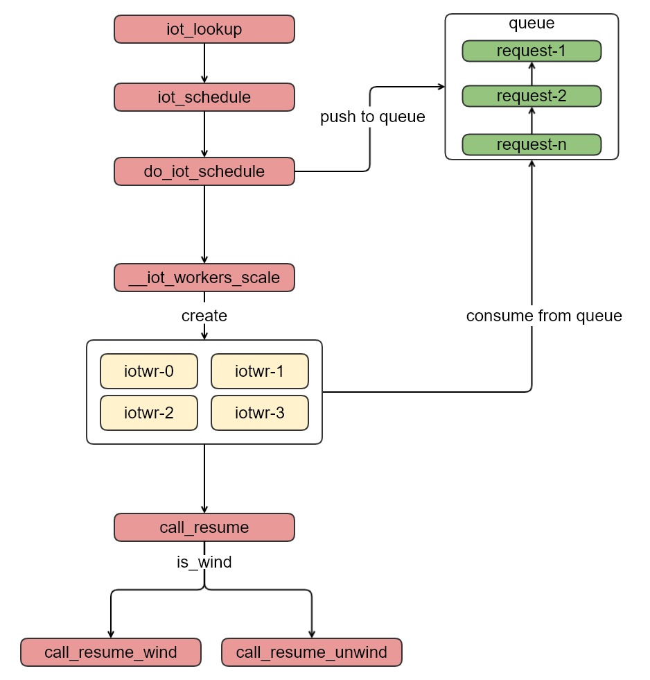

## glusterfs io-thread工作方式

| 作者 | 时间 |QQ技术交流群 |
| ------ | ------ |------ |
| perrynzhou@gmail.com |2020/12/01 |中国开源存储技术交流群(672152841) |


### io-thread介绍
- io-thread 是以translator的方式运行在glusterfsd的进程中，用于动态调整glusterfsd的IO线线程，线程名称是以glfs_iotwr名称开始
- 调整glusterfs的glfs_iotwr线程的参数是performance.io-thread-count。

### 线程数的配置选项
```
// performance.io-thread-count 参数的设定
// IO线程的最小值
#define IOT_MIN_THREADS 1
// IO线程的默认值
#define IOT_DEFAULT_THREADS 16
// IO线程的最大值
#define IOT_MAX_THREADS 64
```
### io-thread translator核心数据结构
- io-thread中定义了4中类型的操作优先级，每个操作都会对应
```
// glusterfs按照fop(create/mkdir/unlink)这些操作进行优先级的设定，每个fop操作和一个优先级绑定，同时一个优先级可以根据参数设定线程数来执行，这样就能达到高并发的的处理来自客户端的IO请求
typedef enum {
    GF_FOP_PRI_UNSPEC = -1, /* Priority not specified */
    // 对应 performance.high-prio-threads 这个参数设定，用于设定高优先级操作fop的线程数
    GF_FOP_PRI_HI = 0,      /* low latency */
    // 对应 performance.normal-prio-threads 参数设定，用于设定一般fop的操作线程数的设定
    GF_FOP_PRI_NORMAL,      /* normal */
    // 对应  performance.low-prio-threads 参数设定,用于低优先级fop操作的线程数
    GF_FOP_PRI_LO,          /* bulk */
    // 对应 performance.least-prio-threads 参数设定
    GF_FOP_PRI_LEAST,       /* least */
    GF_FOP_PRI_MAX,         /* Highest */
} gf_fop_pri_t;

// 这个结构gf_fop_pri_t对应如下参数的设定fop类型的线程数

Option: performance.high-prio-threads
Option: performance.normal-prio-threads
Option: performance.low-prio-threads
Option: performance.least-prio-threads
```
- iot_conf 是io-thread translator的核心数据结构，线程的动态的创建和销毁是按照这个配置文件动态来操作的
```
struct iot_conf {
    pthread_mutex_t mutex;
    pthread_cond_t cond;
    // 这里对应的是 performance.io-thread-count 设定的值
    int32_t max_count;  /* configured maximum */
    
    // 当前的IO线程数
    int32_t curr_count; /* actual number of threads running */
    
    //用于保存休眠时间的的计数器
    int32_t sleep_count;

    int32_t idle_time; /* in seconds */
    //每个优先级fop操作的数组，每个数组是以list形式呈现，这4个数组中每个链表请求很不均衡
    struct list_head clients[GF_FOP_PRI_MAX];
    /*
     * It turns out that there are several ways a frame can get to us
     * without having an associated client (server_first_lookup was the
     * first one I hit).  Instead of trying to update all such callers,
     * we use this to queue them.
     */
    iot_client_ctx_t no_client[GF_FOP_PRI_MAX];
	// 通过用户设定performance.high-prio-threads、performance.normal-prio-threads、performance.low-prio-threads、performance.least-prio-threads来保存这些参数
    int32_t ac_iot_limit[GF_FOP_PRI_MAX];
    // 当前performance.high-prio-threads、performance.normal-prio-threads、performance.low-prio-threads、performance.least-prio-threads参数的值
    int32_t ac_iot_count[GF_FOP_PRI_MAX];
    // 每个操作优先级会有一个值来保存(performance.high-prio-threads、performance.normal-prio-threads、performance.low-prio-threads、performance.least-prio-thread)，queue_sizes来保存fop的请求数
    int queue_sizes[GF_FOP_PRI_MAX];
    // 保存fop请求的总数，这里不缺分是具体哪种优先级的fop操作
    int32_t queue_size;
    gf_boolean_t least_priority; /*Enable/Disable least-priority */

    xlator_t *this;
    size_t stack_size;
    gf_boolean_t down; /*PARENT_DOWN event is notified*/
    gf_boolean_t mutex_inited;
    gf_boolean_t cond_inited;

    int32_t watchdog_secs;
    gf_boolean_t watchdog_running;
    pthread_t watchdog_thread;
    gf_boolean_t queue_marked[GF_FOP_PRI_MAX];
    gf_boolean_t cleanup_disconnected_reqs;
};
```

### 线程扩缩容调用分析

- 函数调用链
  
- 函数分析
```
// 加入请求时一个查找请求
int iot_lookup(call_frame_t *frame, xlator_t *this, loc_t *loc, dict_t *xdata)
{
    IOT_FOP(lookup, frame, this, loc, xdata);
    return 0;
}
// 调用IOT_FOP的
IOT_FOP(lookup, frame, this, loc, xdata) {
	
	// 实际对应的是__stub = fop_lookup_stub(frame, default_lookup_resume, args); 
 	__stub = fop_##name##_stub(frame, default_##name##_resume, args);   
 	// 调用iot_schedule来进行线程扩缩容
    __ret = iot_schedule(frame, this, __stub);                            
 }

// 该函数分为两个阶段，一个是判断fop的优先级，然后设定该fop的优先级；最后是调用线程的缩容或者扩展函数
int iot_schedule(call_frame_t *frame, xlator_t *this, call_stub_t *stub)
{
	int ret = -1;
    gf_fop_pri_t pri = GF_FOP_PRI_MAX - 1;
    iot_conf_t *conf = this->private;
    //判断fop的优先级，然后进行设定
    switch (stub->fop) {
      // 忽略其他
        case GF_FOP_NAMELINK:
            pri = GF_FOP_PRI_HI;
            break;
     }
     // 实际的IO线程的设定
     do_iot_schedule(this->private, stub, pri);
}
// 这里是真正的高潮部分
int do_iot_schedule(iot_conf_t *conf, call_stub_t *stub, int pri)
{
    int ret = 0;
    // 把请求添加到对应优先级列表中，同时更新总请求数
    __iot_enqueue(conf, stub, pri) {
    	list_add_tail(&stub->list, &ctx->reqs);
    	conf->queue_size++;
    	GF_ATOMIC_INC(conf->stub_cnt);
    	conf->queue_sizes[pri]++;
    }
    //进行线程的扩容和缩容
    ret = __iot_workers_scale(conf);
    return ret;
}

// 线程的扩缩容
int __iot_workers_scale(iot_conf_t *conf)
{
    int scale = 0;
    int diff = 0;
    pthread_t thread;
    int ret = 0;
    int i = 0;
	// 获取每个优先级队列请求数和每个优先级配置线程数的最小值
    for (i = 0; i < GF_FOP_PRI_MAX; i++)
        scale += min(conf->queue_sizes[i], conf->ac_iot_limit[i]);

	// 如果scale最小值小于IOT_MIN_THREADS（1）
    if (scale < IOT_MIN_THREADS)
        scale = IOT_MIN_THREADS;
	// 如果是scale的最大值如果操作### 线程数的配置选项 performance.io-thread-count 设定的最大值，则scale设定为 performance.io-thread-count 
    if (scale > conf->max_count)
        scale = conf->max_count;
	// 如果当前IO线程小于scale，则计算出当前和scale之间的差距，根据这个差距来新增IO线程
    if (conf->curr_count < scale) {
        diff = scale - conf->curr_count;
    }

    while (diff) {
        diff--;

        ret = gf_thread_create(&thread, &conf->w_attr, iot_worker, conf,
                               "iotwr%03hx", conf->curr_count & 0x3ff);
       	// 线程分离
        pthread_detach(thread);
    }

    return diff;
}

// IO 的实现工作函数
void *
iot_worker(void *data)
{
	for (;;) {
		// 如果当前io_thread的xlator的总的请求为0，则退出线程
		while (conf->queue_size == 0) {
        	if (conf->down) {
            	bye = _gf_true; /*Avoid sleep*/
             	break;
            }
            // 如果线程空闲时间超过一定的上线线程退出
          	clock_gettime(CLOCK_REALTIME_COARSE, &sleep_till);
          	sleep_till.tv_sec += conf->idle_time;
		  	conf->sleep_count++;
          	ret = pthread_cond_timedwait(&conf->cond, &conf->mutex,&sleep_till);
          	conf->sleep_count--;
		  	if (conf->down || ret == ETIMEDOUT) {
          		bye = _gf_true;
            	break;
           	} 
            // 如果线程处于没有退出的状态
            if (!bye)
            	//取出一个IO任务，更新每个优先级对应的请求数和总请求数
                stub = __iot_dequeue(conf, &pri)
                // 线程内根据xlator graph执行下一个xlator的相关操作
                call_resume(stub);
	}
}

// 根据Final Graph构造的volume图,来选择执行下一个xlator的入口函数
void call_resume(call_stub_t *stub)
{
    xlator_t *old_THIS = NULL;

    errno = EINVAL;
    GF_VALIDATE_OR_GOTO("call-stub", stub, out);

    list_del_init(&stub->list);

    old_THIS = THIS;
    THIS = stub->frame->this;
    {
        if (stub->wind)
            call_resume_wind(stub);
        else
            call_resume_unwind(stub);
    }
    THIS = old_THIS;

    call_stub_destroy(stub);
out:
    return;
}

//从每个优先级链表中取出一个io 请求,然后返回这个请求，同时更新优先级队列的ac_iot_count
call_stub_t *__iot_dequeue(iot_conf_t *conf, int *pri)
{
    call_stub_t *stub = NULL;
    int i = 0;
    iot_client_ctx_t *ctx;

    *pri = -1;
    for (i = 0; i < GF_FOP_PRI_MAX; i++) {
        if (conf->ac_iot_count[i] >= conf->ac_iot_limit[i]) {
            continue;
        }

        if (list_empty(&conf->clients[i])) {
            continue;
        }

        /* Get the first per-client queue for this priority. */
        ctx = list_first_entry(&conf->clients[i], iot_client_ctx_t, clients);
        if (!ctx) {
            continue;
        }

        if (list_empty(&ctx->reqs)) {
            continue;
        }
        if (list_empty(&ctx->reqs)) {
            list_del_init(&ctx->clients);
        } else {
            list_rotate_left(&conf->clients[i]);
        }
	
        conf->ac_iot_count[i]++;
        conf->queue_marked[i] = _gf_false;
        *pri = i;
        break;
    }

    if (!stub)
        return NULL;

    conf->queue_size--;
    conf->queue_sizes[*pri]--;

    return stub;
}
```