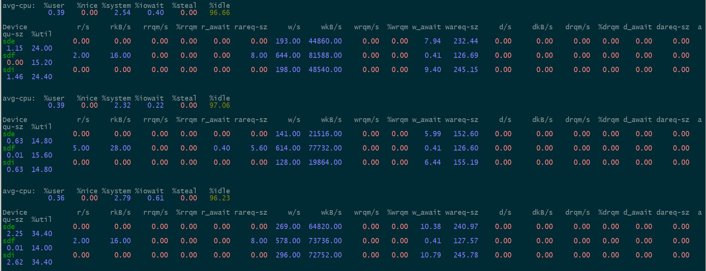

## perf分析glusterfs写操作

| 作者 | 时间 |QQ技术交流群 |
| ------ | ------ |------ |
| perrynzhou@gmail.com |2020/12/01 |中国开源存储技术交流群(672152841) |

#### 测试卷信息

  ```
  Volume Name: rep-vol
  Type: Replicate
  Volume ID: 741c1809-17eb-4ed2-8ef8-5ebf85d3a561
  Status: Started
  Snapshot Count: 0
  Number of Bricks: 1 x 3 = 3
  Transport-type: tcp
  Bricks:
  Brick1: 172.16.84.37:/rep-vol/brick
  Brick2: 172.16.84.41:/rep-vol/brick
  Brick3: 172.16.84.42:/rep-vol/brick
  Options Reconfigured:
  storage.fips-mode-rchecksum: on
  transport.address-family: inet
  nfs.disable: on
  performance.client-io-threads: off
  ```

  

#### perf收集glusterfs信息

  ```
   // ubuntu安装perf
  $ apt install linux-tools-5.4.0-42-generic linux-cloud-tools-5.4.0-42-generic -y
  
  // centos 安装perf
  $ yum install perf
  
  $ ps -ef|grep glusterfs|grep rep-vol
  root     119271      1  0 14:45 ?        00:00:00 /usr/local/sbin/glusterfs --process-name fuse --volfile-server=172.16.84.37 --volfile-id=/rep-vol /mnt/rep-vol
   // glusterfs客户端进程
  $  perf record -F 99 -p 119271 -g
  // perf说明
  -F 99: 每秒采样99次
  -p PID: 指定进程id
  -g: 记录调用栈
  
  ```

#### 客户端和服务端网卡信息都是为1GB/s

  ```
  Settings for bond0:
          Supported ports: [ ]
          Supported link modes:   Not reported
          Supported pause frame use: No
          Supports auto-negotiation: No
          Supported FEC modes: Not reported
          Advertised link modes:  Not reported
          Advertised pause frame use: No
          Advertised auto-negotiation: No
          Advertised FEC modes: Not reported
          Speed: 10000Mb/s
          Duplex: Full
          Port: Other
          PHYAD: 0
          Transceiver: internal
          Auto-negotiation: off
          Link detected: yes
  ```

  

#### 使用perf收集glusterfsd进程信息

  ```
  $ ps -ef|grep glusterfsd|grep rep-vol
  root       58318       1  0 1月04 ?       00:01:46 /usr/local/sbin/glusterfsd -s 172.16.84.37 --volfile-id rep-vol.172.16.84.37.rep-vol-brick -p /var/run/gluster/vols/rep-vol/172.16.84.37-rep-vol-brick.pid -S /var/run/gluster/50691d1e3541a917.socket --brick-name /rep-vol/brick -l /var/log/glusterfs/bricks/rep-vol-brick.log --xlator-option *-posix.glusterd-uuid=2033dcbe-c4a5-4c7b-82cb-1938182d6458 --process-name brick --brick-port 49153 --xlator-option rep-vol-server.listen-port=49153
  
  // 37节点glusterfsd进程
  $  perf record -F 99 -p  58318 -g
  
  ```

#### 运行客户端写入程序

  ```
  $ git clone  https://hub.fastgit.org/perrynzhou/fs-tps.git
  $ cd fs-tps/cmd/generator
  $ ./generator  -g 50000 -n 10240 -p /mnt/rep-vol/ 
  INFO[0000] start writer on  /mnt/rep-vol/               
  goroutine finish 10240 files
  goroutine finish 20480 files
  goroutine finish 30720 files
  goroutine finish 40960 files
  ```

#### 37节点

- zpool


- dstat


- iotop


- network


- iostat



#### 41节点

- zpool


- dstat


- iotop


- network


- iostat


#### 42节点

- zpool


- dstat


- iotop


- network


- iostat


  
#### 生成火焰图

  ```
  # 下载火焰图生成工程
  git clone --depth 1 https://github.com/brendangregg/FlameGraph.git
  
  # 默认读取perf.data文件然后生成out.perf文件
  perf script -i perf.data > out.perf
  
  perf script -i perf.data -F comm,pid,tid,cpu,time,period,event,ip,sym,dso,trace
  # 折叠调用栈
  FlameGraph/stackcollapse-perf.pl out.perf > out.folded
  
  # 生成火焰图
  FlameGraph/flamegraph.pl out.folded > out.svg
  ```
#### glusterfs 火焰图
-  [glusterfs](../../images/glusterfs.svg)
#### glusterfsd 火焰图
-  [glusterfsd](../../images/glusterfsd.svg)
  

#### 疑惑
- 写入测试代码并发写入80M文件，后端glusterfsd的glfs_iotwr线程仅仅是2~3个，很不合理，同时设置了io-thread-count后，这个线程数也没有上去？
- 每个节点机器的网卡是1GB/s,但是后端节点的网络最大也就在300MB/s左右，磁盘的ioutil在30~40之间，明显感觉带宽没有合理用好，这个可能与glusterfsd的IO线程数有关