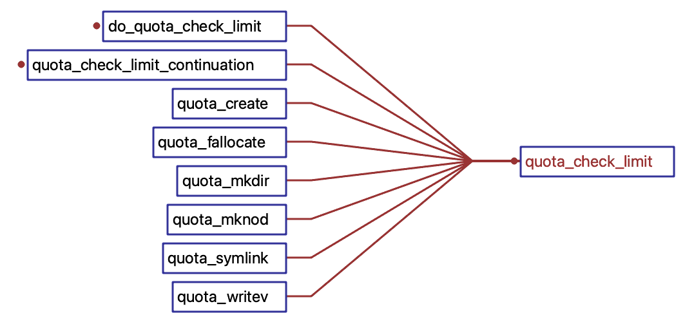

 ## gluster quota介绍

| 作者 | 时间 |QQ技术交流群 |
| ------ | ------ |------ |
| perrynzhou@gmail.com |2020/12/01 |672152841|
#### quota介绍
- 目前glusterfs支持quota,配额限制，默认是quota服务是关闭的.
- glusterfs支持基于目录级别的inode、entries数量和容量配额，这对于有些场景设计非常有必要的。
- Glusterfs-9版本quota的限制是通过设置hard-limit-timeout和soft-limit-timeout定期来检查的，开启后每个object的创建，都会进行quota的检查
#### gluster quta命令

```
// 开启volume的quota功能
# gluster volume quota {test-volume} enable

// 设置hard limit,hard limit是基于容量来限制目录使用上限，后面设置大小的单位可以使MB/GB/TB/PB
# gluster volume quota {test-volume}  limit-usage /data1 100GB
# gluster volume quota {test-volume}  limit-usage /data1 1TB

// 设置 soft limit,soft limit是目录属性用来指定或者说明目录能使用的hard limit的百分比。当目录使用超过了soft limit设定的百分比，用户仍然可以会继续写，但是会不断日志

// 如果用户的在/data1目录设置hard limit为1T,如果数据写入达到了1T会报错；如果没有达到1T，达到了1T * 0.5，会在所在的brick日志不断写日志，来告知已经达到了soft limit
# gluster volume quota {test-volume}  limit-usage /data1 1T 50%

// 显示quota限制的列表
# gluster volume quota {test-volume}  list

// 设置 soft-limit的检查的间隔时间，单位是秒。默认是60s,最大是1800s
gluster volume quota  {test-volume}  soft-timeout  100s

// 设置 hard-limit的检查的间隔时间，单位是秒.默认是5s,最大是60s
gluster volume quota  {test-volume}  hard-timeout  100s

// 设置根目录下data3，存储object上限为3个对象
gluster volume quota test1  limit-objects  /data3 3

// 当客户端挂载时候，用户使用df -h来看容量时候，这个设置开启hard limit体现在目录的容量上
# gluster volume quota  set {test-volume}  features.quota-deem-statfs on 

```

#### qutota 环境
```
[root@CentOS test]# gluster volume info
 
Volume Name: test1
Type: Distribute
Volume ID: f9c8b29e-ae34-4d46-ac1d-3a8d1d87e960
Status: Started
Snapshot Count: 0
Number of Bricks: 1
Transport-type: tcp
Bricks:
Brick1: 10.211.55.13:/data01/brick
Options Reconfigured:
features.quota-deem-statfs: on
features.inode-quota: on
features.quota: on
storage.reserve: 90
diagnostics.brick-log-level: DEBUG
storage.reserve-check-interval: 10
storage.fips-mode-rchecksum: on
transport.address-family: inet
nfs.disable: on

// quotad的 Daemon运行在每一个brick节点
[root@CentOS test]# ps -ef|grep quota
root      2203     1  0 11:30 ?        00:00:00 /usr/local/sbin/glusterfs -s localhost --volfile-id gluster/quotad -p /var/run/gluster/quotad/quotad.pid -l /var/log/glusterfs/quotad.log -S /var/run/gluster/fb5a0c99d40d9c22.socket --process-name quotad
```
#### quota 执行流程
- glusterfs的quota功能是放在服务端进行的，分为三步分别是Accounting、Enforcement、Aggregator
- Accounting(统计阶段)阶段，统计每个目录使用的容量或者obejct数量，是由marker xlator(marker-quto.c)在每个brick进行，这是在后台执行。这个会传递给根目录
- Enforcement(执行)阶段，基于当前目录使用情况来更新目录的使用情况，执行者使用quotad聚合每个brick下目录的统计信息。
- Aggregator(聚合)阶段，quotad是一个服务端的daemon，每个volume节点运行一个.这个daemon统计目录volume的所有brick使用的情况，然后进行容量聚合
- brick的glusterfsd在进行quota检查时候和quotad通过本地的sock进行通信获取目录的容量或者数量属性进行判断
#### quota 执行流程



- qutota 检查函数
```
int32_t
quota_check_limit(call_frame_t *frame, inode_t *inode, xlator_t *this)
{
// 检查文件或者目录个数，这个交给marker xlator进行统计
quota_check_object_limit(frame, ctx, priv, _inode, this, &op_errno, just_validated, par_local,&skip_check);

// 检查目录的总容量所有对象的总大小，这个提交给marker 这个xlator进行统计
quota_check_size_limit(frame, ctx, priv, _inode, this, &op_errno,just_validated, delta, par_local,&skip_check);                                      
}
```
- quota 私有配置
```
struct quota_priv {
		// 设定soft limit的检查间隔时间
		uint32_t soft_timeout;
		// 设定hard_limit 的检查间隔时间
    uint32_t hard_timeout;
    // 设定 soft limit超时后往brick日志文件刷日志的时间间隔
    uint32_t log_timeout;
    // 默认的soft limit，默认值是80%
    double default_soft_lim;
    // volume的quota是否开启
    gf_boolean_t is_quota_on;
    // 是否开启 features.quota-deem-statfs
    gf_boolean_t consider_statfs;
    gf_lock_t lock;
    rpc_clnt_prog_t *quota_enforcer;
    struct rpcsvc_program *quotad_aggregator;
    struct rpc_clnt *rpc_clnt;
    rpcsvc_t *rpcsvc;
    inode_table_t *itable;
    char *volume_uuid;
    uint64_t validation_count;
    int32_t quotad_conn_status;
    pthread_mutex_t conn_mutex;
    pthread_cond_t conn_cond;
    gf_boolean_t conn_status;
};
typedef struct quota_priv quota_priv_t;
```
- 当前brick下quota的上下文信息
```
struct quota_inode_ctx {
    int64_t size;
    // hard limit的保存在hard_lim
    int64_t hard_lim;
    // soft limit的设定的值保存在soft_lim
    int64_t soft_lim;
    // 文件的数量
    int64_t file_count;
    // 目录的数量
    int64_t dir_count;
    // 当前对象的上限
    int64_t object_hard_lim;
    // 当前对象的soft limit的值
    int64_t object_soft_lim;
    struct iatt buf;
    struct list_head parents;
    time_t validate_time;
    time_t prev_log_time;
    gf_boolean_t ancestry_built;
    gf_lock_t lock;
};
typedef struct quota_inode_ctx quota_inode_ctx_t;
```


