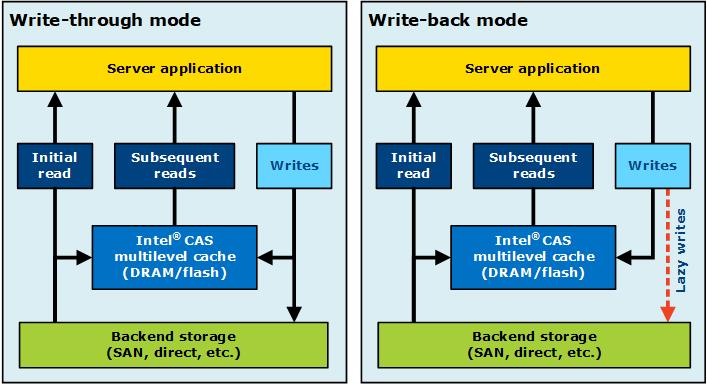

### Intel OpenCAS缓存加速方案

| author | update |
| ------ | ------ |
| perrynzhou@gmail.com | 2020/10/15 |

### Open Cas 架构概览


- 数据从HDD盘读取然后拷贝到open cas 的cache中，后续数据读取都是从内存读取，提高读写效率。
- 在write-through模式，所有的数据都是同步刷新到open cas的ssd和后端hdd硬盘中。
- 在write-back模式中，所有数据同步写入open cas的ssd中，然后异步刷新到HDD中。
- open cas 缓存满后，采用open cas的淘汰算法，用最新写入的数据淘汰以前旧数据，已达到oepn cas始终可以缓存数据。

  


### 系统组件以来

- sed
- make
- gcc
- kernel-devel
- kernel-headers
- python3
- lsblk
- argparse (python module)


### 安装linux open cas

##### 1.open cas 由kernel modules和cli工具组成

##### 2.为了获取最佳性能，强烈推荐在SSD device采用noop的IO调度策略

##### 3.具体安装步骤:

 - 下载open cas linux source

   ```
   git clone https://github.com/Open-CAS/open-cas-linux
   ```

   

- 获取子模块

  ```
  cd open-cas-linux 
  git submodule update –init
  ```

- 配置和安装

  ```
  ./configure
  make
  make install
  ```

- 检查和验证

  ```
  cas_disk.ko  //open cas 磁盘内核模块
  cas_cache.ko //open cas 缓存内核模块
  casadm       //open cas 管理员工具
  casadm -V    //install 检验
  ```

### open cas配置

  - 配置文件在utils/opencas.conf中，包括cache的配置和core devices的配置

      - caches配置说明

        ```
      	1.cache id:执行设备的启动实例ID,整形取值范围在1~16384
      	2.path:指向ssd的磁盘路径
      	3.desired mode:预期模式，一共有5中模式，分别是write-through/write-back/write-only/pass-through
      	4.extra fields:用户自定义IO配置
      		4.1 ioclass_file：允许用户加载自定义IO策略
          	4.2 cleaning_policy ：允许用户缓存清理的策略，包括了acp/alru/nop
      		4.3 promotion_policy ：允许用户使用缓存的推进策略，包括了always/nhit
      	
      	```
      
      - core devices配置说明


      1.cache id:每个core device对应的Cache id，整形，取值范围0~4095
      2.core id:每个core device的id
      3.path:core device的路径
          //每个cache和core devices必须执行已经存储在hdd和ssd,core device应该引用wwn的标识，cache device必须顺序数据。


  - 配置样例
  
    ```
    ## Caches configuration section
    
    [caches]
    
    ## Cache ID Cache device Cache mode Extra fields (optional)
    
    1 /dev/disk/by-id/nvme-INTEL_SSD WT ioclass_file=/etc/opencas/ioclass-config.csv
    
    ## Core devices configuration
    
    [cores]
    
    ## Cache ID Core ID Core device
    
    1 1 /dev/disk/by-id/wwn-0x50014ee0aed22393
    
    1 2 /dev/disk/by-id/wwn-0x50014ee0042769ef
    
    1 3 /dev/disk/by-id/wwn-0x50014ee00429bf94
    
    1 4 /dev/disk/by-id/wwn-0x50014ee0aed45a6d
    
    1 5 /dev/disk/by-id/wwn-0x50014ee6b11be556
    
    1 6 /dev/disk/by-id/wwn-0x50014ee0aed229a4
    
    1 7 /dev/disk/by-id/wwn-0x50014ee004276c68
    ```
  
    

- cas管理工具

  - 手动配置 write-through 模式

    - 在该模式下，   caching  software 写入数据到flash device，然后顺序的写到到core device中，这种模式100%保证core device中数据和cache中数据一致，同时可以共享给其他的服务读取，这种类型可以加速读操作

    ```
    casadm -S -i 1 -d /dev/sdc  //创建id=1的cache
    casadm -A -i 1 -d /dev/sdb  //匹配/dev/sdb到cache
    ```

  - 手动配置write-back模式

    - 在该模式下， caching  software首先把数据先写入到cache中，然后通知用户写完毕了，最后周期性的把数据写入到core device中,write-back模式提高了读写性能，但是会有数据丢失的风险
        ```
        casadm -S -i 1 -d /dev/sdc -c wb
        casadm -A -i 1 -d /dev/sdb  //匹配/dev/sdb到cache
    	```
  - 手动配置Write-around模式
    
    - 在write-around模式下， 只有block数据已经存在于cache中，caching  software把数据才会写入到flash device中，然后顺序写数据到core device.这种模式100%保证core device和cache一致， 写回操作进一步优化了缓存，以避免在写入数据且随后不经常重新读取数据的情况下对缓存的污染 。
  
  	 ```
  		casadm -S -i 1 -d /dev/sdc -c wa
  	 ```
  
	- 手动配置pass-through模式
    - 在该模式下,caching software所有操作都绕开cache.

     ```
		 casadm -S -i 1 -d /dev/sdc -c pt
     ```
  
  - 手动配置write-only模式
  
    - 在write-only模式下,缓存系统先把数据写入到cache中，然后通知应用端写完成。后续周期性的同步写到core device中,当有新的读请求。只有当之前写入数据在cache device中，读请求会绕开cache software,直接读取caching device的数据。该模式仅仅提高写性能，但是会有数据丢失风险。
  
    ```
     casadm -S -i 1 -d /dev/sdc -c wo
    ```
  
    