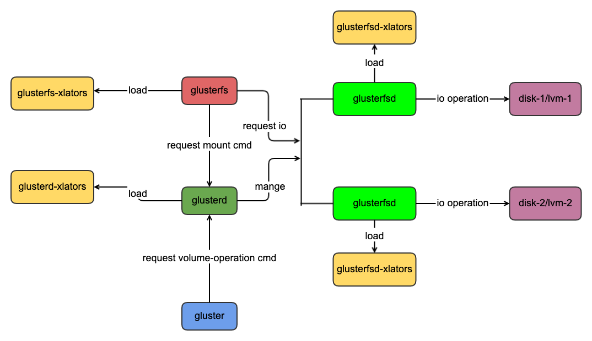
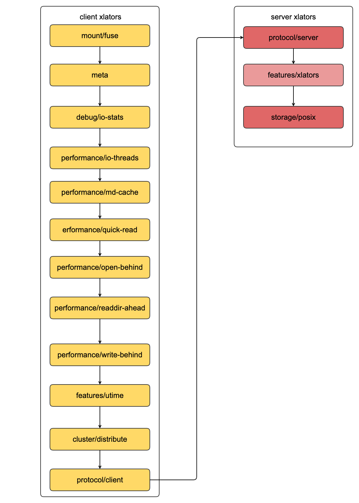

## 架构介绍
  
### glusterfs的进程结构
- glusterfs :用于客户端挂在的进程
- glusterfsd:用于数据读写的进程
- glusterd:物理节点上的glusterfsd的管理进程，glusterd可以管理节点上一个或者多个glusterfsd的进程
- gluster:用于和glusterd管理进程通信的交互的命令行工具
  
### xlators说明
- glusterd-xlators:glusterd需要加载的xlator,默认加载mgnt/glusterd这个xaltor
- glusterfsd-xlators:glusterfsd数据读写进程需要加载的xlators,glusterfsd必须加载protocol/server和storage/posix这2个xlators,一个是glusterfsd进程接受网络请求，一个是接受请求以后进行数据读写。
- glusterfs-xlators:客户端节点用于挂载的和数据处理的xlators加载，glusterfs-xlators必须加载protocol/client和mount/fuse这2个xlators,一个用于客户端数据发送数据到服务端，一个用于处理fuse的请求。
### glusterfs的基本概念
- subvolume:在glusterfs中，一个brick、一组功能的实现，大家可以通俗的说这是一个subvolume
- brick:glusterfsd进程的读写的最小单位就是brick
- volume:一个或者多个brick组成的逻辑存储空间的叫做volume

### 客户端的xlator

- 客户端xlator日志
```
//dht卷的第一个brick，client1
volume dht_vol-client-0
    type protocol/client
    option ping-timeout 42
    option remote-host 10.211.55.3
    option remote-subvolume /glusterfs/dht/brick1
    option transport-type socket
    option transport.address-family inet
    option username dc7532ac-03fa-4888-b092-248ea57aa5db
    option password 29b86bb2-d1f4-4262-be52-5e5edff25374
    option transport.socket.ssl-enabled off
    option transport.tcp-user-timeout 0
    option transport.socket.keepalive-time 20
    option transport.socket.keepalive-interval 2
    option transport.socket.keepalive-count 9
    option strict-locks off
    option send-gids true
end-volume

//dht卷的第二个volume,client2
volume dht_vol-client-1
    type protocol/client
    option ping-timeout 42
    option remote-host 10.211.55.3
    option remote-subvolume /glusterfs/dht/brick2
    option transport-type socket
    option transport.address-family inet
    option username dc7532ac-03fa-4888-b092-248ea57aa5db
    option password 29b86bb2-d1f4-4262-be52-5e5edff25374
    option transport.socket.ssl-enabled off
    option transport.tcp-user-timeout 0
    option transport.socket.keepalive-time 20
    option transport.socket.keepalive-interval 2
    option transport.socket.keepalive-count 9
    option strict-locks off
    option send-gids true
end-volume

//dht,subvolume is dht_vol-client-0 dht_vol-client-1
volume dht_vol-dht
    type cluster/distribute
    option lock-migration off
    option force-migration off
    subvolumes dht_vol-client-0 dht_vol-client-1
end-volume

//utime,subvolume is dht_vol-dht
volume dht_vol-utime
    type features/utime
    option noatime on
    subvolumes dht_vol-dht
end-volume
 
//write-behind,subvolume is dht_vol-utime
volume dht_vol-write-behind
    type performance/write-behind
    subvolumes dht_vol-utime
end-volume
 
//readdir-ahead,subvolume is dht_vol-write-behind
volume dht_vol-readdir-ahead
    type performance/readdir-ahead
    option parallel-readdir off
    option rda-request-size 131072
    option rda-cache-limit 10MB
    subvolumes dht_vol-write-behind
end-volume
 
//open-behind,subvolume is dht_vol-readdir-ahead
volume dht_vol-open-behind
    type performance/open-behind
    subvolumes dht_vol-readdir-ahead
end-volume
 
//quick-read,subvolume is dht_vol-open-behind
volume dht_vol-quick-read
    type performance/quick-read
    subvolumes dht_vol-open-behind
end-volume

//md-cache,subvolume is dht_vol-quick-read 

volume dht_vol-md-cache
    type performance/md-cache
    subvolumes dht_vol-quick-read
end-volume


//io-threads,subvolume is dht_vol-md-cache
volume dht_vol-io-threads
    type performance/io-threads
    subvolumes dht_vol-md-cache
end-volume

//distribute,subvolume is dht_vol-io-threads
volume dht_vol
    type debug/io-stats
    option log-level INFO
    option threads 16
    option latency-measurement off
    option count-fop-hits off
    option global-threading off
    subvolumes dht_vol-io-threads
end-volume
 
//meta-autoload,subvolume is dht_vol
volume meta-autoload
    type meta
    subvolumes dht_vol
end-volume
 
```

- 加载顺序
    
    - 客户端加载的xlator的顺序和配置文件中的顺序相反，客户端的第一个xlator是mount/fuse,第二个是cluster/distribute，最后一个是protocol/client
  